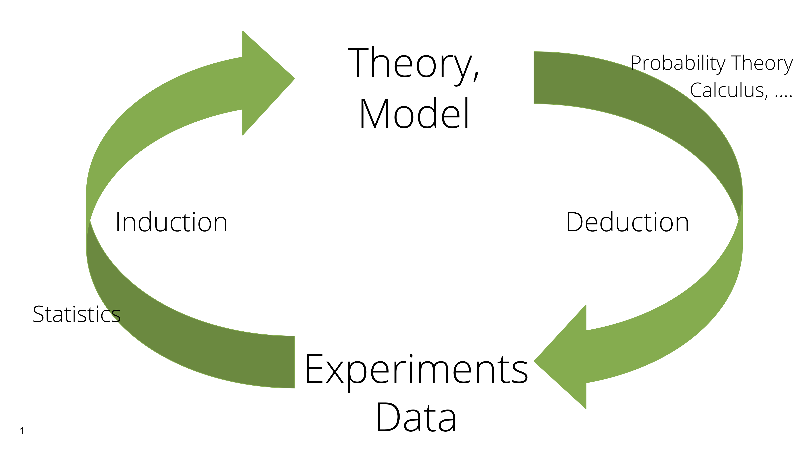

<link href='http://fonts.googleapis.com/css?family=Lato&subset=latin,latin-ext' rel='stylesheet' type='text/css'>

<style type="text/css"> 
.small-code pre code {
  font-size: 1em;
}
body{
  font-family: Lato;
  font-size: 24pt;
  max-width: 1000px;
  margin-left: auto;
  margin-right: auto;
  line-height: 1.5;
}
h1{
  font-family: Lato;
  font-size: 32pt;
  color: #0080FF;
}
h2,h3,h4,h5,h6{
  font-family: Lato;
  font-size: 24pt;
  color: #0080FF;
}
b, strong {
 color: #0080FF;
}
.main-container {
  max-width: 1800px;
  margin-left: auto;
  margin-right: auto;
  line-height:1.5;
}

</style>


# Statistical Modeling

```{r initialize, echo = FALSE, message = FALSE, error = FALSE, warning = FALSE}
knitr::opts_chunk$set(dev = 'png', dpi = 180, fig.margin = TRUE, message = FALSE,
                      cache = TRUE, out.width = "50%", fig.align = "center")
input_dir = function(x)
  path.expand(file.path("~", "Books", "CUBook", x))
  # url(paste0("http://bios221.stanford.edu/", x))

set.seed(0xdada)
```


<!-- {width="30%"} -->
```{r StatisticalML, echo = FALSE, out.width = '27%'}
knitr::include_graphics(input_dir("images/StatDiagram.png"))
```

- Previous lecture: knowledge of a generative model and the values of the *parameters* provided us with
probability distributions of the possible data
- This enhanced our decision making – for instance, whether we had really found an epitope. 
- In many real situations, neither generative distribution nor parameters are known.
- We need to estimate them from the data we have. 

Statistical modeling works from the data *upwards* to a model that *might* plausibly explain the data. 

- This lecture will show us some of the distributions that serve as building blocks for statistical model building and inference in such  situations. 
- The examples in this lecture are all parametric (i.e., the models only have a small number of
unknown parameters), the principles do generalize.

# Goals for this lecture

- See the difference between probabilistic modeling and statistics.
- Fit distributions to data histograms.
- See why we have to use *estimators* instead of actual parameters.
- Give examples of estimating procedures such as *maximum likelihood*.
- Show we can use statistical models and estimation for evaluating dependencies in binomial and multinomial distributions.
- Explore a simple model class for (sequential) data: Markov chains.
- Lab: show concrete applications involving genomes and Bioconductor classes dedicated to the manipulation of genomic data as strings or sequences.

# Parameters are the key

## Examples of parameters 
       
- A single parameter $\lambda$ defines a Poisson distribution.     
- Other distributions have more than one parameter, e.g., binomial $(n, p)$, normal $(\mu, \sigma)$.

```{r parameters, fig.dim = c(6, 2), out.width = '100%'}
library("dplyr")
library("ggplot2")
lapply(c(5, 15, 40), function(lambda)
    tibble(n = 0:60, p = dpois(n, lambda), lambda = lambda)) %>% bind_rows %>%
  ggplot(aes(x = n, y = p)) + geom_point() + facet_grid( ~lambda)
```

# Difference between statistical and probabilistic models

```{r Induction-Deduction, echo = FALSE, out.width = '100%'}

```

In the epitope example, knowing that false positives occur as Poisson(0.01) per position, the number of patients assayed and the length of the protein ensured that there were *no unknown parameters*. Given this probability model, we were able to decide whether the data at hand were compatible with no allergic reaction, or whether they pointed to there being some in some patients. 

Now suppose that we know the number of patients and the length of the protein (these are given by the experimental design). We then observe data, but we suppose now that the false positive rate distribution and its parameter(s) are unknown. 

We need to go *up* from the data we observe to estimate both a probability model $\mathcal{F}$ (Poisson, normal, binomial, ...) and the missing parameter(s) for that model. 

# An example of simple statistical modeling 

There are two parts to the modeling process: 

1. A suitable probability **distribution** for the data generating process
2. A feasible way to **estimate its parameters**

As we saw in Lecture 1, discrete count data can often be modeled by elementary probability distributions such as binomial, multinomial or Poisson distributions. For continuous measurements, the normal distribution is the most elementary building block. Realistic distributions can also be more complicated mixtures of these elementary ones (more on this in the *Mixtures* lecture).

Let’s revisit the epitope data example. We again remove the tricky outlier.

```{r e100, fig.width = 3, fig.height = 3, out.width = "35%", fig.align = "center", echo = -1}
par(mai = c(0.6, 0.6, 0, 0))
load(input_dir("data/e100.RData"))
barplot(table(e100), space = 0.2, col = "forestgreen")
```
```{r e99, results = "hide"}
bad = (e100 > 3)
library("assertthat")
assert_that(sum(bad) == 1)
e99 = e100[!bad]
```

## Goodness-of-fit: visual and quantitative evaluation 

Our first step is to find a fit from candidate distributions. This requires consulting goodness-of-fit plots and quantitative metrics.

One visual diagram is known as the rootogram [@Tukey:1988]. It hangs the observed values from the theoretical values (red points). If the counts correspond exactly to their theoretical values, the bottom of the boxes align exactly with the horizontal axis.

```{r goodfitp}
library("vcd")
gf1 = goodfit(e99, "poisson")
gf1$par
gf1
```

```{r Rootogram, fig.width = 3, out.width = "25%", fig.align = "center"}
rootogram(gf1, xlab = "")
```

## Calibrating our expectations 

```{r roughpar, echo = FALSE, results = "hide"}
assertthat::assert_that(signif(gf1$par$lambda, 1) == 0.5)
```

To see what such a plot looks like with data that we know to come from a Poisson distribution, use $\lambda$ = 0.5 to simulate 100 numbers and draw their rootogram.

```{r RootogramPoisson1}
simdat = rpois(100, lambda = 0.5)
gf2 = goodfit( simdat, "poisson")
```
```{r RootogramPoisson2, fig.width = 3, fig.show = "hide"}
rootogram(gf1, main = "gf1", xlab = "")
rootogram(gf2, main = "gf2", xlab = "")
```
```{r RootogramPoisson3, echo = FALSE, fig.width = 6, out.width = '60%'}
{ 
im1 = EBImage::readImage("Lect2-StatModel_files/figure-slidy/RootogramPoisson2-1.png")
im2 = EBImage::readImage("Lect2-StatModel_files/figure-slidy/RootogramPoisson2-2.png")
imtot = EBImage::Image(dim = dim(im1)*c(2,1,1), colormode = EBImage::colorMode(im1))
imtot[              (1:dim(im1)[1]),, ] = im1
imtot[dim(im1)[1] + (1:dim(im1)[1]),, ] = im2
EBImage::display(imtot, method = "raster")
}
```

# How do we know $\lambda$?

## Or: how did `goodfit` do it?

A Poisson distribution is completely determined by one parameter: $\lambda$ (which is also its mean). 

If we assume that the data follow a Poisson distribution, how do we estimate the 
parameter?

We choose the value that makes the observed data the most likely: **maximum likelihood estimation**

Estimators commonly wear a hat: $\hat{\lambda}$ 

# The likelihood function 

For each possible value of the parameter $\lambda$, we compute the probability of the data.
This is the **likelihood function**

$$
L\left(x=(k_1,k_2,k_3,\ldots),\,\lambda \right) = f(k_1,k_2,k_3,\ldots,\lambda) = \prod_{i=1}^{100} f_\lambda(k_i)
$$

Often, we (equivalently) work with its logarithm. It is as simple as 

```{r functionll}
loglikelihood = function(lambda, k) {
  sum(log(dpois(k, lambda)))
}
```

Note that in this functionm, `k` is a vector and `lambda` is a single number.

Now we can compute the likelihood for a whole series of values from, say, 0 to 1:

```{r poislikel, fig.dim = c(3, 3), out.width = "50%"}
library("magrittr") # for the T-pipe %T>%
lambdas = seq(0, 1, by = 0.01)
ll = sapply(lambdas, loglikelihood, k = e100)
plot(lambdas, ll, type = "l", col = "midnightblue", 
     xlab = expression(lambda), ylab = "", lwd = 2)
m0 = mean(e100) %T>% cat
abline(v = m0, col = "orange3", lwd = 1.5)
abline(h = loglikelihood(m0, k = e100), col = "darkgrey", lwd = 1.5)
```

In fact there is a shortcut: the function `goodfit`.

```{r gfpoisson}
gf = goodfit(e100, "poisson")
gf$par
m0
```


# Classical statistics for classical data

Here is a traditional proof of our computational finding.

$$
\begin{aligned}
\log L(x, \lambda) 
&=\log\prod_{i=1}^{100} e^{-\lambda} \frac{\lambda^{k_i}}{k_i!} \\
&=\sum_{i=1}^{100} -\lambda +k_i \log\lambda-\log (k_i!)\\
&=-100\lambda +\log\lambda\left(\sum_{i=1}^{100} k_i\right)  + \text{const.}
\end{aligned}
$$
To find the $\lambda$ that maximizes this, we compute the derivative in
$\lambda$ and set it to zero. (Exercise: verify that the second derivative is positive.)

$$
\begin{aligned}
\frac{d}{d\lambda}\log L&=-100 +\frac{1}{\lambda}\sum_{i=1}^{100} k_i
\stackrel{!}{=}0\\
\Leftrightarrow\lambda&=\frac{1}{100}\sum_{i=1}^{100} k_i \quad\quad\text{(the mean)}
\end{aligned}
$$


# So what is the value of modeling data with a parametric distribution and parameter estimates?

- Hypothesis testing: formulate a *null model* for the data (e.g., all observations are from the same distribution regardless group or treatment) and check whether this fits

- Alternatively (but not always) we also have an *alternative model* and can compare which one fits better

- Models are also concise but expressive representation of the data - a summary

# Statistical models often combine deterministic and probabilistic parts 

Prototypical: the **linear model**

$$
\begin{align}
&y = ax+b + \varepsilon,\quad\quad \varepsilon\sim N(0,s)\\
\Leftrightarrow\quad&y \sim N( \text{mean} = ax+b, \;\text{sd} = s)
\end{align}
$$

for two continuous variables $x$ and $y$, where we assume that $y$ (the "response") follows a distribution determined by $x$ (the "explanatory variable").

Model fit: the residuals $\varepsilon$ should be independent, identically distributed normal

The linear model can be generalized by

- having more complicated deterministic parts
- have a different stochastic part: e.g., for count data, Poisson ($\leftarrow$ RNA-seq  and
other types of high-throughput sequencing data), or binomial.

# Binomial distributions and maximum likelihood {#sec:likely}

Two parameters: 

- number of trials $n$ - usually known 
- probability $p$ of seeing a “hit”, or a "1", ... in a trial - often unknown

## Example

Someone took a sample of $225$ males and tested them for red-green colorblindness. They coded the data as 0 if the subject was not colorblind and 1 if he was. We can summarize the data `cb` by:

```{r colorblind, echo=FALSE}
cb = c(rep(0, 207), rep(1, 18))
```
```{r cb}
table(cb)
```

Which value of $p$ is the most likely given these data?

$\hat{p}=?$

In this special case, your intuition may give you an estimate (which turns out to be the maximum likelihood estimator, MLE).

ASo let's compute the likelihood for many possible $p$, plot it, and see where the maximum falls.

```{r likely1, fig.dim = c(4, 3), out.width = "50%"}
probs = seq(0, 0.3, by = 0.01)
likelihood = function(p, x)
  dbinom(sum(x), prob = p, size = length(x))

lv = likelihood(probs, cb)
plot(probs, lv, pch = 16, xlab = "p", ylab = "likelihood", cex = 0.6)
```

```{r pv10}
probs[which.max(lv)]
18/225
```

# Another example 

The likelihood and the probability are the same mathematical function,
just interpreted differently.
 
Suppose $n=300$ and we observe $y=40$ successes. Then, for the binomial distribution:

$$
f(\theta\,|\,n,y) = f(y\,|\,n,\theta)={n \choose y} \theta^y (1-\theta)^{(n-y)}.
$$
As the numbers involved are often very large or very small, e.g.,
```{r}
choose(300, 40)
0.5 ^ 260
```
we use the log likelihood, abbreviated by $\ell$ to give:
$$
\log f(\theta |y) = \ell(\theta) = \log {n \choose y} + y\log\theta + (n-y)\log(1-\theta).
$$
Here’s a little function we use to calculate it:
```{r loglike1}
loglikelihood = function(theta, n, k) {
  log(choose(n, k)) + k * log(theta) + (n-k) * log(1 - theta)
}
```
which we plot for the range of $\theta$ (the binomial probability) from 0 to 1.
```{r loglikelihood, fig.width = 5, fig.height = 3.2}
thetas = seq(0, 1, by = 0.001)
llv = loglikelihood(thetas, n = 300, k = 40)
plot(thetas, llv,
  type="l", xlab = expression(theta),
  ylab = expression(paste("loglik(", theta, ")")), main = "")
thetas[which.max(llv)]
```

* The maximum is consistent with intuition (40/300=0.1333....) 
* But we see that many other values of $\theta$ are almost equally likely, as the
 function is quite flat around the maximum. 

# Multinomial data

## Modeling count of DNA base pairs

There are four basic molecules of DNA:  
 A   - adenine,    
 C   - cytosine,   
 G   - guanine,  
 T   - thymine.    
 
The nucleotides are classified into two groups: purines (A and G) and pyrimidines (C and T). 
The binomial distribution won’t work, as we have not two, but four
different possible values. We use the multinomial distribution instead. Let's look at an example.

## Nucleotide bias

Data from the one strand of DNA for the genes of the bacterium *Staphylococcus aureus*  are available in a FASTA file, which we can load as follows.

```{r staph1}
library("Biostrings")
staph = readDNAStringSet(input_dir("data/staphsequence.ffn.txt"), "fasta")
```

Let's print the number of genes and the names of the first two:

```{r staph2}
length(staph)
names(staph)[1:2] %>% strwrap
```

The first gene:

```{r firstgenestaph}
staph[1]
length(staph[[1]])
letterFrequency(staph[[1]], letters="ACGT", OR = 0)
```

We hypothesize that selective pressure can modify the nucleotide frequencies in different genes differently. How do we check for that? 

# Does the nucleotide composition of the first ten genes come from the same multinomial distribution?

We do not have a prior reference, we just want to see whether the nucleotides occur in the same proportions, exemplarily in the first 10 genes. Deviations might deliver a biological insight: different selective pressure on these genes.

```{r compareprop}
tablf = vapply(staph, letterFrequency, letters = "ACGT", OR = 0, 
               FUN.VALUE = numeric(4))
dimnames(tablf)[[2]] = names(staph) %>% 
  sub("^.*gene=", "", .) %>% sub("].*", "", .)
tablfs = tablf[, 1:10]
tablfs
```

Calculate sums of columns - the total number of bases per gene:

```{r sumscols}
bpg = colSums(tablfs)
bpg
sweep(tablfs, 2, bpg, `/`) %>% round(2)
```

We want to compare the nucleotide proportions in these genes.

As a first step, we compute the average proportion for each nucleotide across the genes.

```{r compareprop2}
p0 = rowSums(tablfs) / sum(tablfs)
p0
```

We suppose `p0` is the vector of multinomial probabilities for the four nucleotides, in all the genes. We use a Monte Carlo simulation to test whether the observed departures from the nucleotide frequencies in each gene are within a probable enough range.

We compute the expected counts by taking the outer product of the vector of probabilities p0 by the total number of bases in each gene:

```{r outerex}
expectedtab = outer(p0, bpg)
round(expectedtab)
```

A random table with the correct column sums can be created as follows. (This is done according to the null hypothesis that the true proportions are given by `p0`.)

```{r genrandomtabs}
randomtab = sapply(bpg, function(s) { rmultinom(1, s, p0) } )
randomtab
```

How do we measure whether the two tables are "close"? Here we choose to use the following summary statistic:

$$
\text{diffstat} = \sum_{ij} \frac{(\text{observed}_{ij} - \text{expected}_{ij})^2}{\text{expected}_{ij}} 
$$
or as an R function

```{r computestatnull}
computediffstat = function(o, e) {
  sum((o - e)^2/e)
}
computediffstat(tablfs, expectedtab)
computediffstat(randomtab, expectedtab)
```

Now we do this not only once, but many times. All these statistics constitute the null distribution, as they were generated under the null hypothesis that `p0` is the vector of multinomial proportions.

```{r parabootmulti}
statnull = replicate(8000, {
  randomtab = sapply(bpg, function(s) { rmultinom(1, s, p0) } )
  computediffstat(randomtab, expectedtab)
})
hist(statnull, col = "lavender", breaks = 40, main = "")

statdata = computediffstat(tablfs, expectedtab)
mean(statnull > statdata)
```

We see that in fact the probability of seeing a value as large as `r round(statdata, 1)` is very small. We can conclude that it is very rare that such a value would occur under the  null model (which says that the data come from a common multinomial distribution with `p0` as its probability vector.

# Assessing a distribution’s fit using the QQ-plot

Statistical theory could have helped us avoid us running these simulations.

```{r df, echo = FALSE, results = "hide"}
thedf = prod(dim(tablfs)-1)
assertthat::assert_that(thedf==27)
```
It tells us that the values of the `statnull` statistic are well approximated by a distribution called $\chi^2$ (chi-squared) with parameter `r thedf` (`r nrow(tablfs)-1` times `r ncol(tablfs)-1`). 

Besides reducing your carbon footprint, using theory also is more accurate when you are estimating small probabilities ($\leftarrow$ Lecture 1). Tail probabilities tend to be hard to compute by Monte Carlo. 

We can check how well the theoretical and the simulated distribution match up using another visual goodness-of-fit tool: the QQ-plot. 

(NB: A perhaps seemingly more intuitive approach to compare two distributions, whether from two different samples, or one from a sample and one from a theoretical model, would be looking at
their histograms and/or densities. But this is clumsy and difficult to read.)

## Quantiles

In the previous lecture on the epitope data, we ordered the 100 sample values $x_{(1)},x_{(2)},\ldots,x_{(100)}$. Then, for instance, any value between the 22nd and the 23rd, will be acceptable as a 0.22-quantile $c_{0.22}$. We can also write this as $x_{(21)} \leq c_{0.22} < x_{(23)}$. $c_{0.22}$ is any number such that 22% of the values are smaller than it:

$$
c_{0.22} \text{ is any number such that: } 
\frac{1}{n} \#\left\{i:\,x_i\leq c_{0.22}\right\}= 0.22 
$$
we also write
$$
\hat{\mathcal F}_n(c_{0.22})
=c_{0.22},
$$ 
where $\hat{\mathcal F}_n$ is a function we call the empirical cumulative distribution function (ECDF).

```{r quant12, echo = FALSE, fig.dim = c(5, 3), out.width = "50%", fig.cap="The histogram of the distribution of `statnull` and the quantiles $c_{0.22}$ and $c_{0.995}$"}
hist(statnull, main = "", xlab = "", col = "lavender", breaks = 60)
abline(v = quantile(statnull, 0.22),  col = "purple", lwd = 2, lty = 2)
abline(v = quantile(statnull, 0.9955),col = "blue",   lwd = 2, lty = 2)
```
We can now compute the quantiles of the data vector and compare them to the those of
the $\chi_{27}^2$ distribution. 

```{r quantiles3, eval = FALSE, echo = FALSE}
x1 = quantile(statnull, probs = pp)
x2 = quantile(qchisq(pp, df = thedf), probs = pp)
```

```{r qqplot3, warning=FALSE, fig.width=4, fig.height=4}
pp = ppoints(length(statnull))
head(pp)
qqplot(qchisq(pp, df = 27), statnull, pch=".", cex = 2,
       col="purple", xlab = expression(chi["df=27"]^2),
       xlim = c(10, 55), ylim=c(10, 55))
qqline(statnull, dist = function(p) qchisq(p, df = 27),
          col="blue", lty=6, lwd=2)
```

Now that we have established that `statnull` follows a $\chi^2_{27}$ distribution, we can use this fact to compute our p-value: the probability that we would observe a value as high as `r round(statdata, 1)`:

```{r pvalueBias}
1 - pchisq(statdata, df = 27)
```

# Chargaff’s rule 

In fact, it was Chargaff who discovered the most important
pattern in the nucleotide frequencies. Long before DNA sequencing was
available, he used the weight of the molecules.

```{r Chargaff, echo = FALSE, out.width = '40%', fig.cap = "Erwin Chargaff, 1947"}
knitr::include_graphics(input_dir("images/ChargaffColdSpring.png"))
```

Unfortunately, Chargaff only published the *percentages* of
the mass present in different organisms for each of the nucleotides, not
the measurements themselves.

```{r loadChargaff}
load(input_dir("data/ChargaffTable.RData"))
ChargaffTable
```

```{r ChargaffBars, echo = FALSE, fig.dim = c(7, 4), out.width = "80%", fig.cap = "Each barplot was made with a different row from the above table. There is certainly a tendency in the nucleotide frequencies."}
mycolors=c("chocolate","aquamarine4","cadetblue4","coral3","chartreuse4","darkgoldenrod4","darkcyan","brown4")
par(mfrow=c(2, 4))
for (i  in 1:8){
cbp=barplot(ChargaffTable[i,],horiz=TRUE,axes=FALSE,axisnames=FALSE,col=mycolors[i])
mtext(side = 2, text = colnames(ChargaffTable), at = cbp, col = mycolors[i], line = 0,las=2,cex=1)
ax=axis(3,las=2,labels=FALSE,col = mycolors[i],cex=0.5,at=c(0,10,20))
mtext(side = 3, at = ax, text= paste(ax),col = mycolors[i], line = 0, las=1, cex = 1)
title(paste(rownames(ChargaffTable)[i]),col= mycolors[i],cex=1.4)
}
```

## Do these data seem to come from equally likely multinomial categories?

Chargaff *saw* the answer to this question and postulated a pattern called  *base pairing*,   which ensured a perfect match of the (molar) amount of adenine (A) in the DNA of an organism to
the amount of thymine (T). This is now called Chargaff’s rule. Similarly, whatever the amount of guanine (G), the amount of cytosine (C) is the same. The departure from the balanced multinomial distribution is not subtle.

## Testing for significant base pairing 

Suppose a first round of data revealed the pattern ($p_{\mbox{C}}=p_{\mbox{G}}$ and $p_{\mbox{A}}=p_{\mbox{T}}$), and now we want to test this hypothesis with the data above from a  *second round*  of experiments, summarized by the above table.

Define our test statistic to be
$$
(p_{\mbox{C}}-p_{\mbox{G}})^2+(p_{\mbox{A}}-p_{\mbox{T}})^2
$$ 
summed over all rows of the table. This value should be the smaller, the more similar the frequencies of paired nucleotides are.

```{r testequality}
nucleotide_frequencies = ChargaffTable / 100
statchargaff = function(x) {
  sum((x[, 2] - x[, 1])^2 + (x[, 4] - x[, 3])^2)
}
statchargaff(nucleotide_frequencies)
permstat = replicate(10000, {
  permuted = t(apply(nucleotide_frequencies, 1, sample))
  statchargaff(permuted)
})
fractionsmallerorequal = mean(permstat <= statchargaff(nucleotide_frequencies))
fractionsmallerorequal
```

```{r permstatC, echo=FALSE, fig.width = 6, fig.height = 3}
hist(permstat, breaks = 50, main = "", col = "lavender")
abline(v = statchargaff(nucleotide_frequencies), lwd = 2, col = "red")
```

Question 1: should we think of `fractionsmallerorequal` as a p-value?

Question 2: if we had come up with the hypothesis that $p_{\mbox{C}}=p_{\mbox{G}}$ and $p_{\mbox{A}}=p_{\mbox{T}}$ from the same data that we then use to compute `fractionsmallerorequal`, would there be a problem?
 
# Codon usage patterns

A sequence of three nucleotides (a codon) in a coding region of a gene can be transcribed into one of 20 possible amino acids. There are $4^3 = 64$ possible codon sequences, but only 20 amino acids.

The multiplicity (the number of codons that code for the same amino acid) varies from 2 to 6. The different codon-spellings of each amino acid do not occur with equal probabilities. Let’s look at the data for the standard laboratory strain of tuberculosis (H37Rv):

```{r Mycotub}
library("readr")
Myc = read_table(input_dir("data/M_tuberculosis.txt"), col_names = TRUE, comment = "#")
Myc
```

The codons for the amino acid proline are of the form `CC*`, which occur with the following frequencies.

```{r ProlMyc}
library("dplyr")
MycPro = filter(Myc, AmAcid == "Pro")
MycPro$Codon
MycPro$Number / sum(MycPro$Number)
```
```{r check, echo = FALSE, results = "hide"}
assertthat::assert_that(nrow(MycPro) == 4)
```

The counts enable us to estimate the theoretical probabilities (or parameters) by taking the maximum likelihood estimates as the proportions with which each occurs. 

Exercise: use a $\chi^2$-distribution with 3 degrees of freedom as the reference distribution to which you compare the $\chi^2$-statistic computed from the actual numbers of occurence of the four categories (proline codons) and their expected values.

# Working with two categorical variables

Up to now, we have visited cases where the data are taken from a sample that can be classified into different boxes: the binomial and Poisson for Yes/No binary boxes and the Multinomial for categorical variables such as A/C/G/T or genotypes such as aa/aA/AA.

However, it might be that we measure two (or more) categorical variables on a set of subjects, for instance eye color and hair color. We can then cross-tabulate the counts for every combination of eye and hair color. This concept, called **contingency table**, is useful for many biological data types.

```{r vcdHC}
HairEyeColor
```

`HairEyeColor` is a 3 dimensional array with three dimensions:    
 - 1 Hair: Black, Brown, Red, Blond    
 - 2 Eye: Brown, Blue, Hazel, Green     
 - 3 Sex: Male, Female    

```{r answerHC}
dim(HairEyeColor)
? HairEyeColor
```

#### Color blindness and sex

Deuteranopia is a form of red-green color blindness due to the fact that
medium wavelength sensitive cones (green) are missing. A deuteranope can
only distinguish 2 to 3 different hues, whereas somebody with normal
vision sees 7 different hues. A survey for this type of color blindness
in human subjects produced a two-way table crossing color blindness and
sex.

```{r Deuto}
load(input_dir("data/Deuteranopia.RData"))
Deuteranopia
```

How do we test whether there is a relationship between sex and the
occurence of color blindness? 

We postulate the null model of two independent binomials: one for sex and one for color blindness, with parameters from the respective marginal distributions. Under this model we know all the table cells‘ probabilities, and we can compare the observed counts to the expected ones. In R, this is done through the `chisq.test` function.

```{r chisq.test.Deuteranopia}
chisq.test(Deuteranopia)
```

# Concatenating several multinomials: motifs

The [Kozak Motif](http://www.sciencegateway.org/resources/kozak.htm) is a sequence that occurs close to the start codon **ATG** of a coding region. The start codon itself always has a fixed spelling, but in positions 5 to the left of it, there is also a nucleotide pattern that is not fixed, but in which the letters are quite far from being equally likely.

We summarize this by giving the Position-Weight-Matrix(PWM), which provides the multinomial probabilities at every position. This is encoded graphically by what is called a **logo**.

```{r seqlogo}
library("seqLogo")
load(input_dir("data/kozak.RData"))
kozak
pwm = makePWM(kozak)
seqLogo(pwm, ic.scale = FALSE)
```

# Recap

What have we noticed in our study of the frequencies in these 'box' models
for categorical variables?

- different ‘boxes‘ in the multinomials we have encountered are rarely of equal size, i.e., equality of the different $p_i$’s is the exception rather than the rule.

- departures from independence (i.e., correlations) of two categorical variables (sex and colorblindness, hair and eye color, ..) are common. 

We will see in a later lecture that we can explore the directions, patterns in and possible explanations for these dependencies by using multivariate decompositions of the contingency tables.

An important special case of dependent categorical variables are sequences (in time and/or space).

# Markov chains

Dependence in ordered observations occurs, for instance, in temporal weather patterns and nucleotides along a sequence: the distribution of the next value depends on the ones before.

Sometimes it is useful to make a simplifying assumption: the distribution of the next value depends only on the one before. If this holds, we call it the *Markov property*. (A different way of stating the assumption is that the current values, or *state*, contains all information that there needed to predict all the future behaviour of the system -- cf. Newtonian, Hamiltonian mechanics.)

For DNA sequences, we may see specific succession patterns so that the pairs of nucleotides, called digrams (e.g., CG, CA, CC and CT) are not equally frequent. For instance in parts of the genome we see more frequent instances of CA than we would expect under independence:

$$
P(\mbox{CA}) \neq P(\mbox{C})P(\mbox{A}).
$$ 

```{r Markov-Chain, echo = FALSE, out.width = '40%'}
# knitr::include_graphics("img/kisspng-markov-chain-hidden-markov-model-stochastic-proces.png")
knitr::include_graphics("img/chap2-statsfourstateMC-1.png")
```

## Transition matrix

$$
\left(\begin{array}{cccc}
W_{11}&W_{12}&\ldots&W_{1n}\\
W_{21}&W_{22}&\ldots&W_{2n}\\
\vdots&\vdots&      &\vdots\\
W_{n1}&W_{n2}&\ldots&W_{nn}\\
\end{array}\right)
$$

If at time (or sequence position, ...) $t$ the value (or state) is $i$ ($i\in\{1,\ldots,n\}$), the probability that at time $t+1$ the value (state) is $j$ is $W_{ij}$.

The row sums and the column sums of the matrix $W$ are all one ($\sum_i W_{ij} = \sum_j W_{ij} = 1$), and all $W_{ij}\ge0$. Such a matrix is also called a stochastic matrix.

How to estimate a transition matrix from data?

# Bayesian Thinking

Up to now we have followed a classical approach where probabilities are defined as long term frequencies from observations. If we visit a new place and have had four days of sunshine, we might estimate that the probability of sunshine here is 100% and that of rain 0%. However, this does not take into account any other information that we might already know. For that we need a different approach, which is able to combine prior knowledge as well as the data at hand: this is provided by the Bayesian paradigm.

Bayesian thinking also operates in terms of parameters (i.e. 'knowledge' = parameter values). However, at any point in our chain of reasoning (even prior to seeing the current data), there is a probability distribution on our parameters. Once the current data is seen, we simply update the distribution, which is then called the posterior.

<!-- {width="0.8\linewidth"} -->

```{r Turtlesallthewaydown, echo = FALSE, out.width = '60%', fig.cap = "Turtles all the way down"}
knitr::include_graphics(input_dir("images/turtles.jpg"))
```

# Simulation study of the Bayesian paradigm for the binomial distribution $\text{B}(n,\theta)$

Instead of assuming that our parameter $\theta$ has one single value, the Bayesian world view lets us to see it as a draw from a statistical distribution. 

The distribution expresses our belief about the possible values of the parameter $\theta$. 

In principle, we can use any distribution that we like that takes values in the same range of values as our parameter (we also call that the distribution’s **support**). 
 
For a parameter that expresses a proportion or a probability, and which takes its values
between 0 and 1, it is convenient to use the  **beta distribution**. Its density is:

$$
f_{\alpha,\beta}(x) = \frac{x^{\alpha-1} (1-x)^{\beta-1}}{\mathrm{B}(\alpha, \beta)}, \quad\text{ where  }
\mathrm{B}(\alpha ,\beta)=\frac{\Gamma(\alpha)\Gamma(\beta)}{\Gamma(\alpha+\beta)}
$$

We can see that this function depends on two parameters $\alpha$ and $\beta$, making it a very flexible family of distributions (so it can ’fit’ a lot different situations). We also see that not only gene naming can be confusing: here both the name of the distribution family and one of its two parameters is called beta.

Now here comes a nice fact: if we start with a prior belief that our distribution of $\theta$ is beta-shaped, observe a dataset of $n$ binomial trials, then update our belief, the posterior will also have a beta distribution, albeit (usually) with new parameters. 

This is a provable mathematical property, which is expressed by saying that the binomial and the beta are *conjugate*. We will not prove it, however we illustrate it with a simulation.

# Priors and the marginal distribution

Consider a random variable $Y$ that is binomial distributed with parameter $\theta$. We have seen how the density of $Y$ (or sampled histograms) look when $\theta$ takes a given, fixed value. But what happens if $\theta$ itself also varies according to some distribution?

We call this the **marginal distribution** of $Y$.

Let’s simulate that. We first generate a random sample of 10000 $\theta$s, and
for each of these we then generate a random sample of $Y$.

```{r histmarginal, fig.width = 3, fig.height = 3, out.width = "50%", fig.cap = "Histogram of $Y$"}
rtheta = rbeta(100000, 50, 350)
y = sapply(rtheta, function(th) {
  rbinom(1, prob = th, size = 300)
})
hist(y, breaks = 50, col = "orange", main="")
```

## Histogram of all the thetas such that $Y=40$: the posterior distribution

So let’s suppose we observed an experimental data point where $Y$ was 40. How does this change our belief about the distribution of $\theta$? We compute the posterior distribution of $\theta$ by conditioning on those outcomes where $Y$ was 40 (`thetaPostEmp`), and also the one given by theory (`densPostTheory`). 

```{r densityposterior, fig.width=3, fig.height = 3.5, out.width = "40%"}
thetaPostEmp = rtheta[y == 40]
hist(thetaPostEmp, breaks = 40, col = "chartreuse4",
     probability = TRUE, main = "", xlab = expression("posterior"~theta))
densPostTheory = dbeta(thetas, 90, 610) # more on this below
lines(thetas, densPostTheory, type = "l", lwd = (1+sqrt(5))/2)
```

We can check the means of both versions of the posterior distribution and see that they are close to 4 significant digits.

```{r comparetheory}
mean(thetaPostEmp)
dtheta = thetas[2]-thetas[1]
sum(thetas * densPostTheory * dtheta)
```

To get the mean of the theoretical density, above we computed the integral $\int_0^1 \theta f(\theta) d\theta$ using numerical integration, i.e., by summing over the integrant. This is not always convenient (or feasible), in particular when our parameters are high-dimensional (e.g., if our model involved not only a single $\theta$ parameter, but several thousand as for instance in the case of image analysis). In such cases, and when an analytic solution is also not available, we can resort to Monte Carlo integration (which here is very simple):

```{r mcint}
thetaPostMc = rbeta(n = 1e6, 90, 610)
mean(thetaPostMc)
```

## The posterior distribution is also a beta

Now we have seen that the posterior distribution is also a beta. In our
case its parameters 90 and 610 were obtained by adding to the prior
parameters 50, 350  the number of observed successes, 40, and observed
failures, 260. Thus the general rule is 
$$
\text{beta}(\alpha_{\text{post}}, \beta_{\text{post}}) = 
\text{beta}(\alpha_{\text{prior}} + y,\beta_{\text{prior}} + (n-y))
$$ 

## Now suppose we have a second set of observations

After seeing our first set of data, we have a new belief about our $\theta$, namely $\text{beta}(90, 610)$. It acts as our new prior if we collect a new set of data. Say we make $n=150$ observations of which there were $y=25$ successes, 125 failures.

What is now our new best belief about $\theta$?

Using the same reasoning as before, the new posterior will be
$$
\text{beta}(90+25=115,\, 610+125=735).
$$ 

The mean of this distribution is $\frac{115}{115+735}=\frac{115}{850}\simeq 0.135$, thus one point estimate of $\theta$ would be 0.135.

The theoretical (MAP) estimate would be the mode of $\text{beta}(115, 735)$, i.e., $\frac{114}{848}\simeq 0.134$. Let’s check this numerically.

```{r postbeta}
densPost2 = dbeta(thetas, 115, 735)
mcPost2   = rbeta(1e6, 115, 735)

sum(thetas * densPost2 * dtheta)  # mean, by numeric integration
mean(mcPost2)                     # mean, by MC
thetas[which.max(densPost2)]      # MAP estimate
```

<!-- {width="0.3\linewidth"} -->

```{r MonteCarlo, echo = FALSE, out.width = '30%'}
knitr::include_graphics(input_dir("images/roulette.png"))
```

The last line of this code uses a Monte Carlo method for finding the MAP
from a sample from `rbeta(., 115, 735)`.

## Exercise

Redo these computations replacing our original prior with a softer prior (broader, less peaked), synonymous with less prior information. How much does this change the final result?

As a general rule, the prior rarely changes the posterior distribution substantially except if it is very peaked (i.e., if, at the outset, we were already rather sure of it) or if there
is very little data.

The best situation to be in is to have enough data to swamp the prior so that its choice has negligible impact on the final result.

## Confidence statements

Sometimes we don't just want a point estimate, but a **credible interval** (a Bayesian equivalent of the **confidence interval**). E.g., we can take the 2.5 and 97.5 percentiles of the posterior distribution:

$$
P (L \leq \theta \leq U) = 0.95
$$ 

```{r quantilespost}
quantile(mcPost2, c(0.025, 0.975))
```

# Example: haplotype frequencies

Here's a forensics example using signatures from the Y chromosome called haplotypes. Our roadmap is:

- We'll first look at the motivation and terminology behind the computations involved in haplotype frequency analyses. 
- Then we’ll revisit the concept of likelihood.
- We’ll see how we can think of unknown parameters as being random numbers, modeling our uncertainty about them with a prior distribution. 
- Finally, we'll see how to incorporate newly observed data into
the distributions and compute a posterior distribution and confidence
statements about the parameters.

In this example we want to estimate the proportion of a particular
Y-haplotye assembled from the different short tandem repeats (STR).

<!-- {width="1.1\linewidth"} -->

```{r STRDefinition, echo = FALSE, fig.cap = "STR", out.width = '80%'}
knitr::include_graphics(input_dir("images/STRDefinition.png"))
```

The combination of values at the special STR locations used for
forensics are labeled by the number of repeats at the specific
positions. Here is part of an STR haplotype table:

      Individual DYS19 DXYS156Y DYS389m DYS389n DYS389p
    1         H1    14       12       4      12       3
    2         H3    15       13       4      13       3
    3         H4    15       11       5      11       3
    4         H5    17       13       4      11       3
    5         H7    13       12       5      12       3
    6         H8    16       11       5      12       3

This says that the haplotype H1 has 14 repeats at position DYS19, 12 repeats at position  DXYS156Y,  $\ldots$. We want to find the underlying proportion $\theta$ of the haplotype of interest in the population of interest. We are going to consider the occurrence of a haplotype as a ‘success’ in a binomial distribution using collected observations.

# A more complicated example from RNA-seq analysis

<!-- {width="\textwidth"} -->

```{r PredictionInterval, echo = FALSE, out.width = '42%', fig.cap = "From Love, Huber and Anders in their article about the `DESeq2` package."}
knitr::include_graphics(input_dir("images/DESeq2-Prediction-Interval.png"))
```

Shown are the prior (solid black line), the likelihoods (solid lines, scaled to integrate to 1)
and the posteriors (dashed lines) for two genes (green and purple). Due to the higher dispersion of the data for the purple gene, its likelihood is wider and less peaked (indicating less information), so the prior has more influence on its posterior than for the green gene.

The stronger curvature of the green posterior at its maximum translates to a smaller reported standard error for the MAP logarithmic fold change (LFC) estimate (horizontal error bar).

# Worked examples using biological sequence data

In Section 2.10, Questions 2.21 - 2.23 of the book, we explore the occurrence of the **Shine-Dalgarno motif** AGGAGGT in the genome of E.coli. This motif helps initiate protein synthesis in bacteria. We look at the frequency at which it occurs per length of genomic sequence, and at distances between its occurences.

In Section 2.10.1, Questions 2.24 - 2.26, we look at differences between dinucleotide frequencies in regions of the human genome called **CpG islands** and the rest.

# Summary of this lecture

This lecture explained how to go from a set of experimental data back to a distribution model and its parameters. 

We saw statistical models for experiments with two or more possible (categorical) outcomes: binomial and multinomial. 

We saw maximum likelihood and Bayesian estimation procedures. 

We saw examples on codon usage and nucleotide pattern discovery.

Further reading: Chapter 2 in the book

