```{r setup, include=FALSE}
knitr::opts_chunk$set(echo = FALSE)
library("readr")
library("magrittr")
library("dplyr")
library("tibble")
library("ggplot2")
library("tidyr")
library("EBImage")
library("SummarizedExperiment")
library("spatstat")
library("geometry")
library("RColorBrewer")
theme_set(theme_light())
```

## What You Will Learn in Today's Lecture

* **Read**, **write**, **transform** images in `R`
* Apply **filters** and **morphological operations**
* Cell **segmentation**
* **Extract features** from segmented cells
* Analyze **spatial** patterns using spatial point processes
* Align images using **registration**
* We will look at many **case studies** from the real world
* What is different about **Spatial Data Analysis**?

# The EBImage Package

## Images Are Just Data

A useful toolkit for handling images in R is the Bioconductor package **EBImage** [@pau2010ebimage]

```{r echo=TRUE, eval=FALSE}
library("EBImage")
```

## Read Image

We start out by reading in a simple picture to demonstrate the basic functions

```{r read_image, echo=TRUE}
imagefileloc="http://bios221.stanford.edu/data/mosquito.png"
mosq = readImage(imagefileloc)
```

## Display Image

```{r display_image, echo=TRUE}
display(mosq)
```

## Tranform Image

```{r rotate_image, echo=TRUE}
EBImage::rotate(mosq, angle = 30) %>% display()
```

## Tranform Image

```{r translate_image, echo=TRUE}
translate(mosq, v = c(40, 70)) %>% display()
```

## Tranform Image

```{r flip_image, echo=TRUE}
flip(mosq) %>% display()
```

## How Are Images Stored in R?

\footnotesize

```{r image_class, echo=TRUE}
class(mosq)
dim(mosq)
str(mosq)
```

## Print Image Object

\footnotesize

```{r print_image, echo=TRUE}
print(mosq)
```

## Load and Display Color Image

\footnotesize

```{r load_display_color_image, echo=TRUE, out.width="0.5\\linewidth", fig.align="center"}
imagefileloc="http://bios221.stanford.edu/data/hiv.png"
hivc = readImage(imagefileloc)
display(hivc, method = "raster")
```

## Print Image Object

\footnotesize

```{r print_color_image, echo=TRUE}
print(hivc)
```

## Load and Display Multple Images

\footnotesize

```{r load_display_multiple_image, echo=TRUE, out.width="0.5\\linewidth", fig.align="center"}
imagefile = system.file("images", "nuclei.tif",
                        package = "EBImage")
nuc = readImage(imagefile)
display(nuc, method = "raster", all = TRUE)
```

## Print Image Object

\footnotesize

```{r print_multiple_image, echo=TRUE}
print(nuc)
```

## Object Oriented Programming in R

* Two most common systems for object oriented programming in R:
    * **S3**: Heavily used in packages on **CRAN**
    * **S4**: Heavily used in **Bioconductor** (in BioC 3.3: 3158 classes and 22511 methods defined in 609 out of 1211 packages)
* As a user it can be useful to recognize S3/S4 objects, explore, manipulate and use the help system
* Years of experience in Bioconductor have shown that S4 classes allow to construct rich and complicated data representations
* Let's compare S3 and S4 classes

## S3 Classes

\footnotesize

```{r lm, echo=TRUE}
df = data.frame(y = rnorm(10), x = rnorm(10))
lm_object = lm(y ~ x, data = df)
class(lm_object)
lm_object
```

## S3 Classes

\footnotesize

```{r lm_object, echo=TRUE}
is.list(lm_object)
attributes(lm_object)
```

## S3 Classes

* In standard R, an S3 object is a list with a class attribute

\footnotesize

```{r fake_lm1, echo=TRUE}
xx = list(a = letters[1:3], b = rnorm(3))
xx
```

## S3 Classes

* The problem is that we can assign any class to any list

\footnotesize

```{r fake_lm2, echo=TRUE}
xx = list(a = letters[1:3], b = rnorm(3))
class(xx) = "lm"
xx
```

## S4 Classes

* S4 classes have a formal definition and formal validity checking
* To the end user, this guarantees validity of the object
* Example: SummarizedExperiment will check dimensions of features table, samples table, and assay matrices
```{r summarized_experiment_figure, out.width="0.6\\linewidth",fig.align="center"}
knitr::include_graphics("images/SummarizedExperiment.pdf")
```

## S3 vs. S4

* S3 implements a style of OO programming called **generic-function** OO
* This is different from most programming languages, like Java, C++, and C#, which implement **message-passing** OO
* Message-passing:
    * Messages (methods) are sent to objects and the object determines which function to call
    * Object has a special appearance in the method call, usually appearing **before** the name of the method/message: e.g., canvas.drawRect("blue")
* Generic-function:
    * Computations are still carried out via methods
    * Special type of function called a generic function decides which method to call, e.g., drawRect(canvas, "blue")
    * Very casual system, no formal definition of classes

## S3 vs. S4

* S4 works similarly to S3, but is more formal
* From a user perspective, there is **one major difference** to S3
    1. Fields of an S4 object are not attributes or named elements, but instead are called slots and are accessed with the special ``@`` or ``slot()`` operator (instead of ``$`` and ``[[``)

# Image Processing Tools: \newline\newline Compression, Linear Filters, Morphological Operations, Voronoi Tessellation, Feature Extraction

## Compression

* Images contain many **low-complexity** regions: spatial repeats / patterns, values not using the full theoretical dynamical range
* Lossless: Original data can be perfectly reconstructed from the compressed data, e.g., gzip, bzip2; with images: PNG, TIFF (optional)
* TIFF: Very flexible format that be lossless as well as lossy, also allows lots of metadata
* For scientific images: **use lossless** formats

## Compression

\footnotesize

```{r compression, echo=TRUE}
object.size(hivc) %>% 
  format(units = "Mb")
(object.size(hivc) / prod(dim(hivc))) %>% 
  format %>% 
  paste("per pixel")
writeImage(hivc, "hivc.jpeg", quality = 85)
(file.info("hivc.jpeg")$size / 2^20) %>% 
  round(digits = 2) %>% 
  paste("Mb")
```

## Compression

Left: Original image. Right: Compressed image.

```{r compare_compression}
hivc_compressed = readImage("hivc.jpeg")
par(mfrow = c(1,2))
display(hivc, method = "raster")
display(hivc_compressed, method = "raster")
invisible(file.remove("hivc.jpeg"))
```

## Linear Filters

* In image processing, a **kernel**, convolution matrix, or mask is a small matrix
* It is used for blurring, sharpening, embossing, edge detection, and more
* This is accomplished by doing a **convolution** between a kernel and an **image**

## Linear Filter

```{r convolution1, out.width="0.8\\linewidth",fig.align="center"}
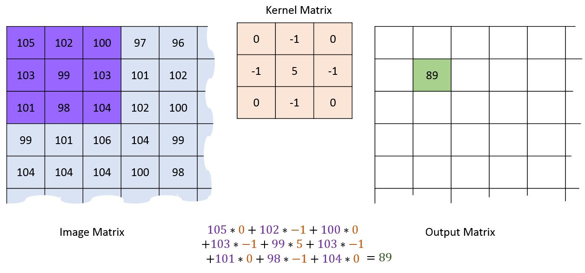
```

Image source: [machinelearninguru.com](http://machinelearninguru.com/computer_vision/basics/convolution/image_convolution_1.html)

## Linear Filter

```{r convolution2, out.width="0.8\\linewidth", fig.align="center"}
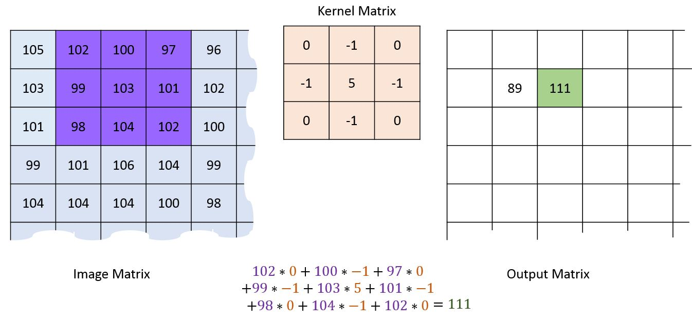
```

Image source: [machinelearninguru.com](http://machinelearninguru.com/computer_vision/basics/convolution/image_convolution_1.html)

## Linear Filter

```{r edge_detection, echo=TRUE}
kernel = matrix(-1, nrow = 3, ncol = 3)
kernel[2,2] = 8
kernel
```

## Linear Filter: Edge Detection

Left: Original image. Right: Filtered image.

```{r appy_edge_detection, warning=FALSE, message=FALSE}
original = readImage("images/orginal.jpg")
edge = filter2(original, kernel, boundary = "replicate")
par(mfrow = c(1,2))
display(original, method = "raster")
display(edge, method = "raster")
```

## Linear Filter

```{r blurring, echo = TRUE}
kernel = makeBrush(size = 3, shape = "gaussian", 
                   sigma = 1)
kernel
```

## Linear Filter: Blurring

Left: Original image. Right: Blurred image.

```{r apply_blurring}
edge = filter2(original, kernel, boundary = "replicate")
par(mfrow = c(1,2))
display(original, method = "raster")
display(edge, method = "raster")
```

## Morphological Operations

* **erode**: For every foreground pixel, put the mask around it, and if any pixel under the mask is from the background, then set all these pixels to background.

```{r erode, out.width="0.4\\linewidth",fig.align="center"}
knitr::include_graphics("images/Erosion.png")
```

Image source: [wiki](https://en.wikipedia.org/wiki/Mathematical_morphology)

## Morphological Operations

* **dilate**: For every background pixel, put the mask around it, and if any pixel under the mask is from the foreground, then set all these pixels to foreground.

```{r dilate, out.width="0.4\\linewidth",fig.align="center"}
knitr::include_graphics("images/Dilation.png")
```

Image source: [wiki](https://en.wikipedia.org/wiki/Mathematical_morphology)

## Morphological Operations

* **erode + dilate = opening**: Eliminates noise outside objects

```{r erode_dilate, out.width="0.4\\linewidth",fig.align="center"}

```

Image source: [slideshare.net](https://www.slideshare.net/guard0g/neural-networks-in-the-wild-handwriting-recognition)

## Morphological Operations

* **dilate + erode = closing**: Eliminates noise within objects

```{r dilate_erode, out.width="0.4\\linewidth",fig.align="center"}
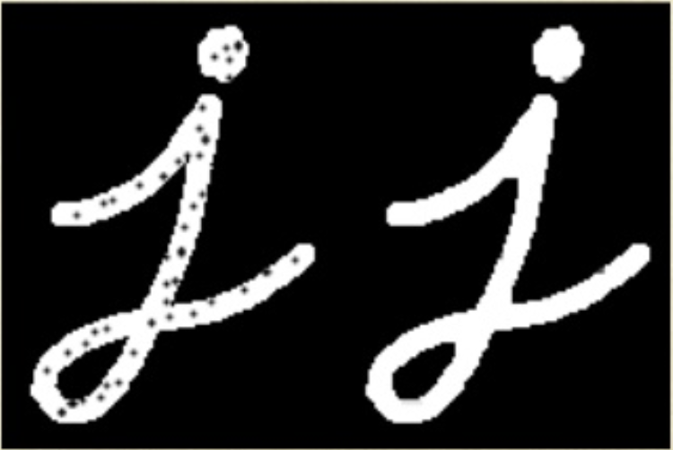
```

Image source: [slideshare.net](https://www.slideshare.net/guard0g/neural-networks-in-the-wild-handwriting-recognition)

## Voronoi Tessellation

```{r voronoi, out.width="0.5\\linewidth",fig.align="center"}
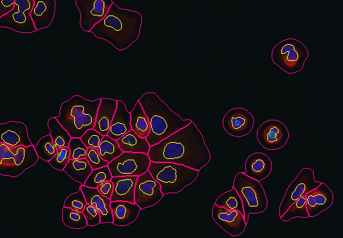
```

Image source: [Figure 11.19 in the book](http://web.stanford.edu/class/bios221/book/Chap-Images.html#fig:cellbodies)

## Voronoi Tessellation: Distances

Animated gif: [wiki](https://en.wikipedia.org/wiki/Voronoi_diagram#/media/File:Voronoi_growth_euclidean.gif)

```{r voronoi_distances, out.width="0.9\\linewidth",fig.align="center"}
knitr::include_graphics("images/voronoi_distances.pdf")
```

Image source: [wiki](https://en.wikipedia.org/wiki/Voronoi_diagram)

## Voronoi Tessellation: Distances

* Euclidean distance between $(x,y)$ and $(x+dx,y+dy)$:
\[ ds^2 = dx^2 + dy^2 \]

* Extend it by including image gradient $g$:
\[ ds^2 = \frac{2}{\lambda+1} [ \lambda (dx^2 + dy^2) + (dx g_x)^2 + (dy g_y)^2] \]

```{r gradient, out.width="0.8\\linewidth",fig.align="center"}
knitr::include_graphics("images/intensity_image_with_gradient_images.png")
```

Image source: [wiki](https://en.wikipedia.org/wiki/Image_gradient)

## Voronoi Tessellation: Distances

\[ ds^2 = \frac{2}{\lambda+1} [ \lambda (dx^2 + dy^2) + (dx g_x)^2 + (dy g_y)^2] \]

* $\lambda$ controls the weight of the Euclidean distance term:
    * For $\lambda \to \infty$, $ds$ tends to the Euclidean distance
    * For $\lambda \to 0$, $ds$ tends to the intensity gradient of the image
    * For $\lambda = 1$, Euclidean distance and image gradient contribute equally

## Feature Extraction

* Extract features by processing cell images using using
    * linear filter
    * morphological operators, and
    * Voronoi tessellation 
    * Many more...

## Feature Extraction

* We can now use multivariate analysis methods: 
    * **Clustering**: Detecting cell subpopulations
    * **Classification**: Classifying cells into pre-defined cell types or phenotypes
    * **Differential analysis**: Seeing whether the absolute or relative frequencies of the subpopulations or cell types differ between images that correspond to different biological conditions

# Case Study: \newline Stem Cell Differentiation

## Goal

* Methods to characterize mesenchymal stem cells (MSCs) are limited to 
    * CD marker expression
    * Plastic adherence 
    * Ability to differentiate into adipogenic, osteogenic and chondrogenic precursors
* Stem cells undergoing differentiation should differ in many aspects, such as 
    * Morphology
    * Behaviour
* Goal of this study was to predict cell fate of MSCs from morphological features
* Using Time-lapse microscopy: https://www.youtube.com/watch?v=HM17p1vDF9A

## Data

* We monitored cells using a time-lapse microscope
* Take an image of each well every 2 hours
* Start 20 min after seeding cells
* Run for 6 days with break after 3 days for media refreshment
* Covered the exponential growing phase until confluence
* The data is stored in tiff images

## Cell Segmentation

```{r stemcells_segmentation, out.width="\\linewidth",fig.align="center"}
knitr::include_graphics("images/stemcells_segmentation.png")
```

## Cell Features

```{r stemcells_features, out.width="\\linewidth",fig.align="center"}
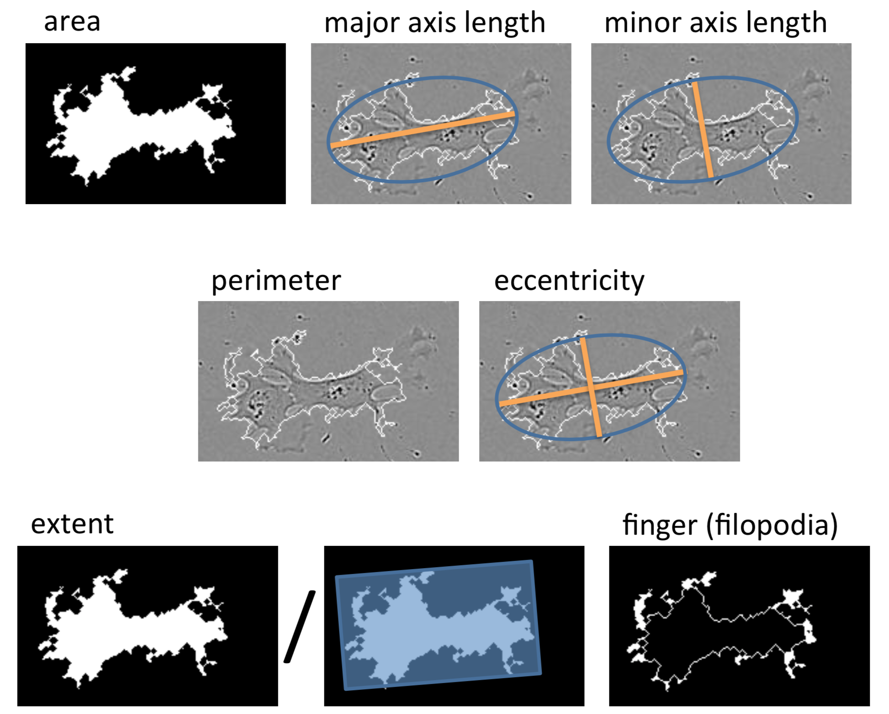
```

## Cell Classifier

```{r stemcells_classifier, out.width="\\linewidth",fig.align="center"}
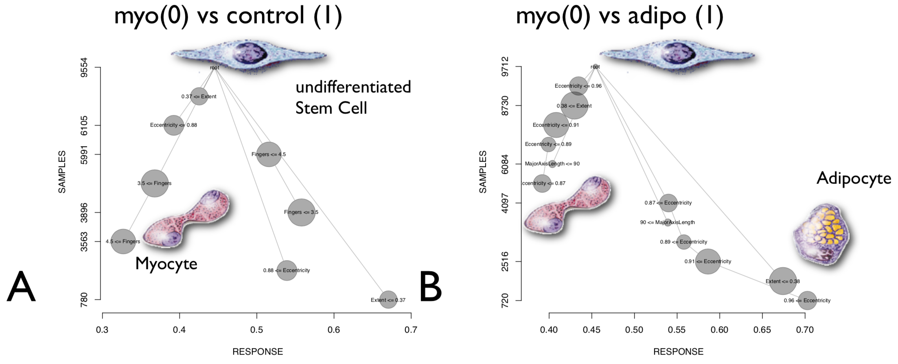
```

## Results and Conclusions

* Our results suggest: 
    * Non-invasive automated time-lapse microscopy could potentially
be used to predict the hMSCs fate on morphology earlier time-points
    * Might be useful in for clinical application
* More challenges:
    * Cell density
    * Proliferation and possible unknown donor-specific factors
* For more see @seiler2014time

# Spatial Statistics

## Motivation

* Now: Will make use of spatial position of cells in our analyses
* Basic question: Are neighboring points clustering? (i.e., do they attract or repel each other?)
    * crime patterns within a city
    * disease patterns within a country
    * soil measurements in a region

## Motivation

```{r stainedlymphnode, out.width="0.8\\linewidth",fig.align="center"}
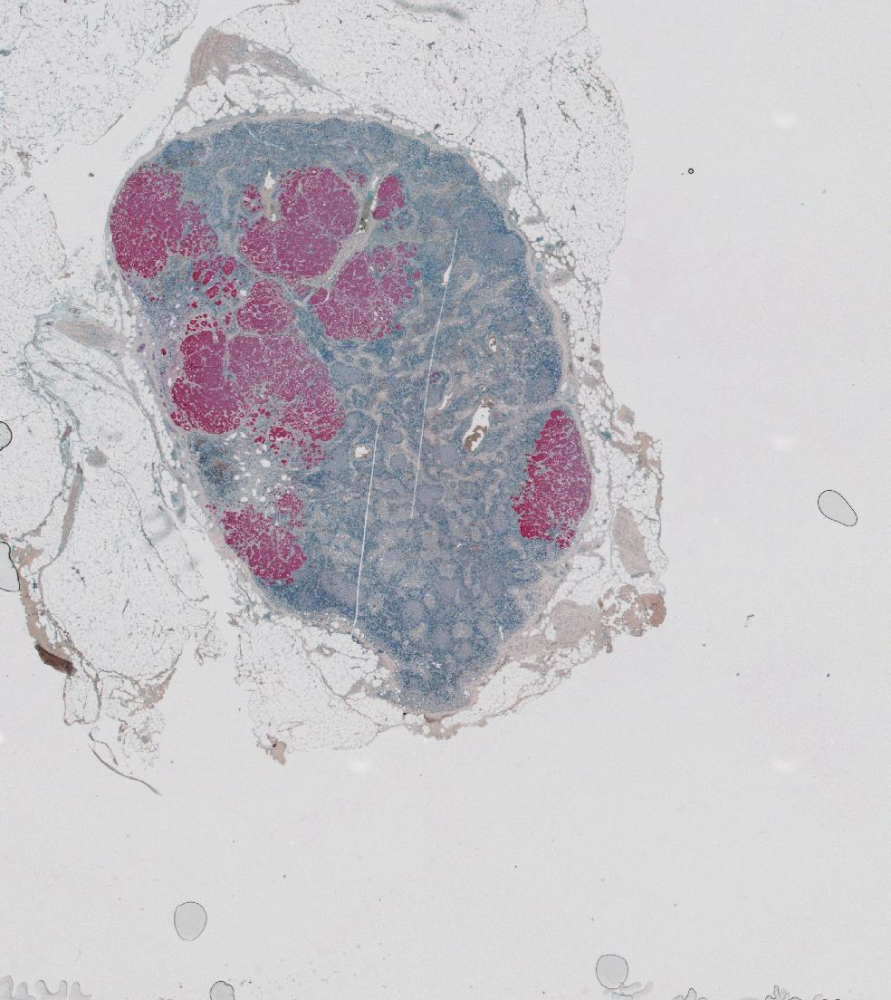
```

Image source: [Figure 11.22 in the book](http://web.stanford.edu/class/bios221/book/Chap-Images.html#fig:stainedlymphnode)

## Interaction Between Immune and Cancer Cells

* Data from [@setiadi2010quantitative]
* Segment cells using the image processing tools we learned about earlier
* We end up with coordinates and the type of all the cells in the image
* We call this type of data a **marked point process**
 
## Interaction Between Immune and Cancer Cells

* Load data table:

```{r load_brcalymphnode, message=FALSE, warning=FALSE}
cellclasses = c("T_cells", "Tumor", "DCs", "other_cells")
brcalymphnode = lapply(cellclasses, function(k) {
    read_csv(file.path("data",
             sprintf("99_4525D-%s.txt", k))) %>%
    transmute(x = globalX,
              y = globalY,
              class = k)
}) %>% bind_rows %>% mutate(class = factor(class))
```

\footnotesize

```{r print_brcalymphnode, echo=TRUE}
brcalymphnode
```

## Interaction Between Immune and Cancer Cells

* Count cell types:

```{r table_brcalymphnode, echo=TRUE}
table(brcalymphnode$class)
```

## Interaction Between Immune and Cancer Cells

* Plot the $x$ and $y$ positions of the cells:

```{r plot_brcalymphnode, fig.height=4, fig.width=7}
ggplot(filter(brcalymphnode, class %in% c("T_cells", "Tumor")),
   aes(x = x, y = y, col = class)) + geom_point(shape = ".") +
   facet_grid( . ~ class) + guides(col = FALSE) + coord_fixed()
```

## Interaction Between Immune and Cancer Cells

* Create spatial point process object **ppp** from package **spatstat**:

\footnotesize

```{r spatstat, echo=TRUE}
ln = with(brcalymphnode,
  spatstat::ppp(x = x, y = y, 
                marks = class, 
                xrange = range(x), yrange = range(y)))
ln
```

## Interaction Between Immune and Cancer Cells

* Compute convex hull using package **geometry**:

```{r geometry, echo=TRUE}
coords = cbind(ln$x, ln$y)
chull = geometry::convhulln( coords )
```

```{r prepare_hull}
pidx = integer(nrow(chull) + 1)
pidx[1:2] = chull[1, ]
chull[1, ] = NA
for(j in 3:length(pidx)) {
  wh = which(chull == pidx[j-1], arr.ind = TRUE)
  stopifnot(nrow(wh )== 1)
  wh[, "col"] = 3 - wh[, "col"] ## 2->1, 1->2
  pidx[j] = chull[wh]
  chull[wh[, "row"], ] = NA
}
pidx = rev(pidx)
```

```{r plot_hull, fig.height=4, fig.width=4, out.width="0.4\\linewidth", fig.align="center"}
ggplot(tibble(x = ln$x, y = ln$y)[pidx, ], aes(x = x, y = y)) +
  geom_point() + geom_path() + coord_fixed()
```

## Interaction Between Immune and Cancer Cells

* Call ppp again, this time with the polygon:

\footnotesize

```{r echo=TRUE}
ln = with(brcalymphnode,
   spatstat::ppp(x = x, y = y, marks = class, poly = coords[ pidx, ],
       check = FALSE))
ln
```

## Poisson Process

* Key question: What we expect by chance?
* Strategy: Define a probabilistic model as null model
* The simplest spatial process is the **Poisson process**
* We will use it as a null model against which to compare our data

## Poisson Process

* Examples: Rain drops falling on the floor are modeled by a Poisson process
* The number of drops falling on a particular spot depends on 
    * rate $\lambda$
    * size of the spot
    * but not on what happens at other spots
    
```{r rain_drops, out.width="0.4\\linewidth",fig.align="center"}
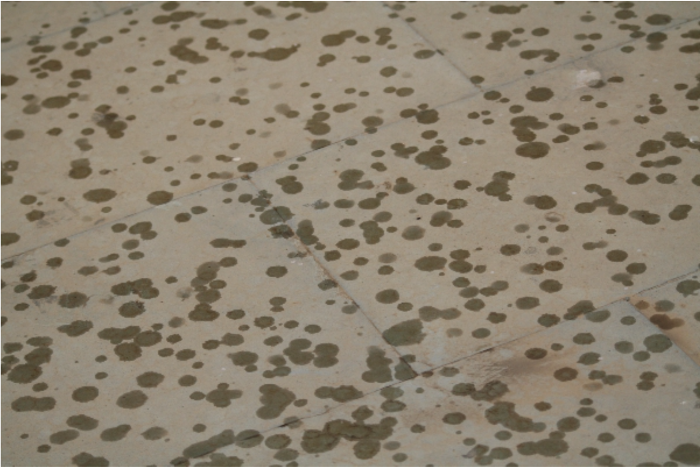
```

Image source: [Figure 11.25 in the book](http://web.stanford.edu/class/bios221/book/Chap-Images.html#fig:stainedlymphnode)

## Poisson Process

* Count the number of points lying in a circle of area $a$ around a point $p$
* Denote this quantity by $N(p,a)$
* Then look at the mean and covariance of $N(p,a)$
* The mean is
\[
\lambda(p) = \lim_{a \to 0} \frac{\operatorname{E}[N(p,a)]}{a}
\]
* Stationary process: $\lambda(p) = \text{constant}$

## First Order Effects: The Intensity

* Check visually if $\lambda(p)$ is constant by estimating local rate at point $p$:
\[
\widehat{\lambda}(p) = \sum_i e(p_i) K(p - p_i)
\]
    * kernel function *K* (decays as a function of distance to point $p$)
    * edge correction factor $e(p_i)$

## First Order Effects: The Intensity

* This is implemented in spatstat package:

```{r density_plot, fig.height=5,fig.width=5,out.width="0.4\\linewidth",fig.align="center", echo=TRUE}
d = density(subset(ln, marks == "Tumor"), edge=TRUE, 
            diggle=TRUE, sigma=250)
plot(d)
```

## First Order Effects: The Intensity

* Probability that a cell is of cell of certain type at $p_i$ **given** any cell present at $p_i$

```{r relrisk_plot, fig.height=5,fig.width=5,out.width="0.4\\linewidth",fig.align="center"}
plot(relrisk(ln, sigma = 250))
```

## Second Order Effects: Spatial Dependence

* If we pick a point at random in our spatial process, what is the distance $R$ to its nearest neighbor? 
* For a homogeneous Poisson process, the cumulative distribution function of this distance is
\[
G(r) = P(R \le r) = 1 - e^{-\lambda \pi r^2}
\]

## Second Order Effects: Spatial Dependence

```{r plot_gest_small, fig.height=5,fig.width=5,out.width="0.5\\linewidth",fig.align="center"}
plot(Gest(ln), xlim = c(0, 10), lty = 1, col = brewer.pal(4, "Set1"))
```

* Cell to cell distances that are shorter are less likely than for the null model
    * There are essentially no distances below 2
    * Cells have finite size and cannot overlap the same space

## Second Order Effects: Spatial Dependence

```{r plot_gest_large, fig.height=5,fig.width=5,out.width="0.5\\linewidth",fig.align="center"}
plot(Gest(ln), xlim = c(30, 50), lty = 1, col = brewer.pal(4, "Set1"))
```

* There seems to be a trend to avoid very large distances
    * Perhaps indicative of a tendency of the cells to cluster?

## Second Order Effects: Ripley's $K$ Function

```{r kfunction_scale, out.width="0.7\\linewidth",fig.align="center"}
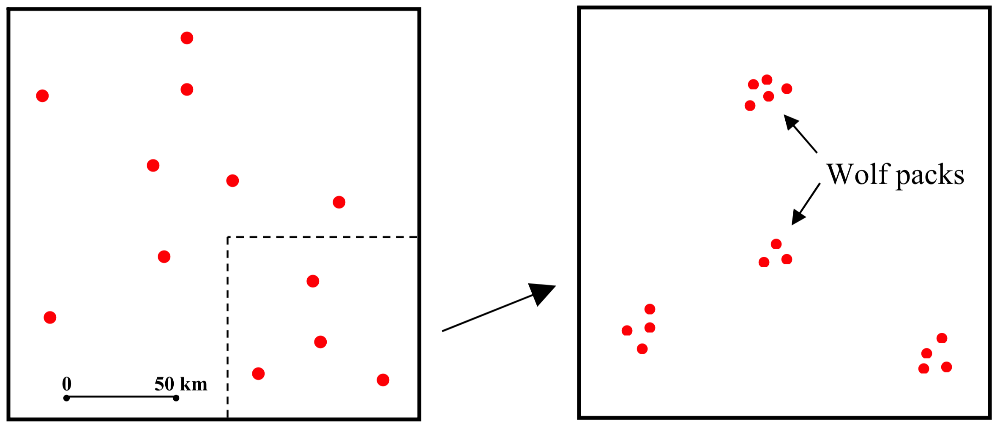
```
Image source: [UPenn ESE 502 Lecture Slides](https://www.seas.upenn.edu/~ese502/)

* This pattern of wolf locations is 
    * very clustered at small scales
    * very dispersed at large scales
* Useing nearest-neighbor techniques would only detect small-scale clustering

## Second Order Effects: Ripley's $K$ Function

* What is the average number of points found near a randomly picked point?
* The $K$-function ($d_{ij}$ is distance between point $i$ and $j$):
\[ \widehat{K}(r) = \widehat{\lambda}^{-1} \left( \frac{1}{n} \sum_i \sum_{j \ne i} I(d_{ij} < r) \right) \]
* Under the homogeneous Poisson process: $\widehat{K}(r) \approx \pi r^2$ (area of the circle)
* $L$-function: $\widehat{L}(r) = \sqrt{ \frac{\widehat{K}(r)}{\pi} }$
* So, $L(r) = r$ under complete spatial randomness

## Second Order Effects: Ripley's $K$ Function

```{r plot_repley_k, message=FALSE, warning=FALSE, fig.height=5, fig.width=5, out.width="0.5\\linewidth", fig.align="center"}
Lln = Linhom(subset(ln, marks == "T_cells"))
plot(Lln, xlim = c(0, 10), lty = 1, col = brewer.pal(3, "Set1"))
```

* This data seems to be more clustered compared to a complete spatial random pattern

# Medical Image Analysis

## Medical Images

* Medical images are **three**-dimensional and EBImage is great for **two**-dimensional images
* A useful toolkit for handling images in R is the package **SimpleITK** [@lowekamp2013design, @yaniv2018simpleitk]
* Also it provides some more advanced feature such as **image registration**

## Image Registration

* Image registration is the task of finding a spatial transform mapping one image into another

```{r image_registration, out.width="0.5\\linewidth",fig.align="center"}
knitr::include_graphics("images/image_registration.png")
```

Image source: [The ITK Software Guide](https://itk.org/ItkSoftwareGuide.pdf)

## Image Registration

* Left: Fixed image. Right: Moving image.

```{r fixed_moving_images, out.width="0.8\\linewidth",fig.align="center"}
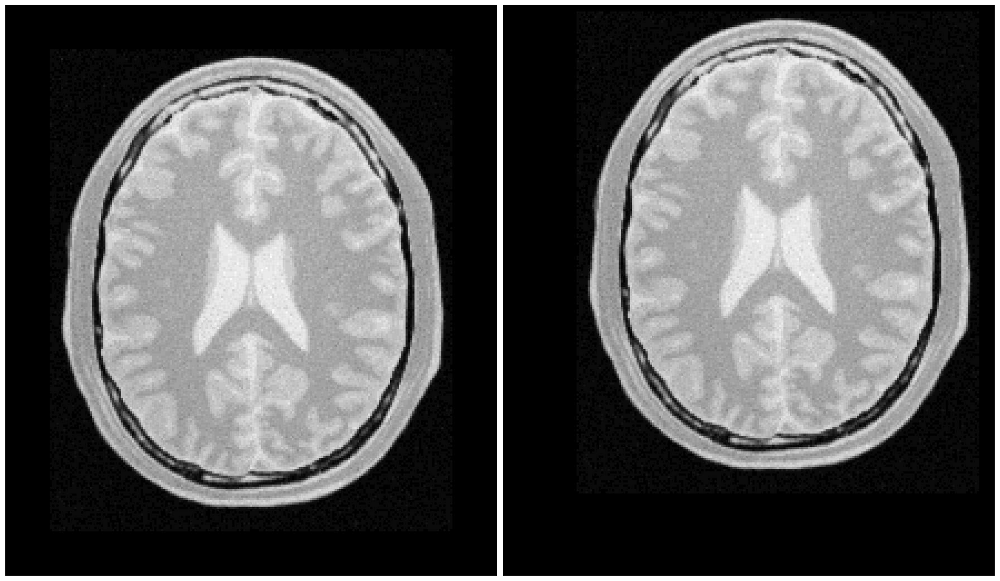
```

Image source: [The ITK Software Guide](https://itk.org/ItkSoftwareGuide.pdf)

## Image Registration

* Mapped moving image and its difference with the fixed image before and after registration

```{r mapped_moving_image, out.width="0.8\\linewidth",fig.align="center"}
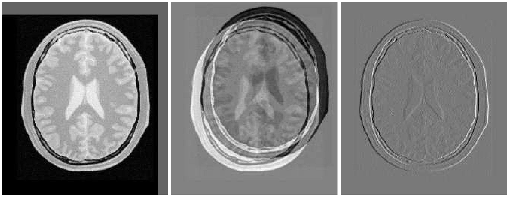
```

Image source: [The ITK Software Guide](https://itk.org/ItkSoftwareGuide.pdf)

## The SimpleITK Package

Installation requires cmake and git in the path:

```{r install_simple_itk, echo=TRUE, eval=FALSE}
devtools::install_github("SimpleITK/SimpleITKRInstaller")
```

For more: [SimpleITK-Notebooks](https://github.com/InsightSoftwareConsortium/SimpleITK-Notebooks/tree/master/R)

# Case Study: \newline Brain Morphometry

## Goal and Methods

* Compare brain morphology between girls with Turner syndrome and age-matched control group
* Use registration to map brains to an average brain
* Compare deformations between groups
* For more see @seiler2018multi

## PCA Results

* Left: Participants projected onto PC1 and PC2
* Right: 10% largest \textcolor{red}{positive} and 10% \textcolor{blue}{negative} PC1 loadings
* Blue brain regions are larger in the TS group and smaller in the healthy control group

```{r morphomety_pca, out.width="\\linewidth",fig.align="center"}
knitr::include_graphics("images/morphology_pca.pdf")
```

# Case Study: \newline Brain Activity in Dead Salmon

## Results

```{r dead_salmnon, out.width="0.9\\linewidth",fig.align="center"}
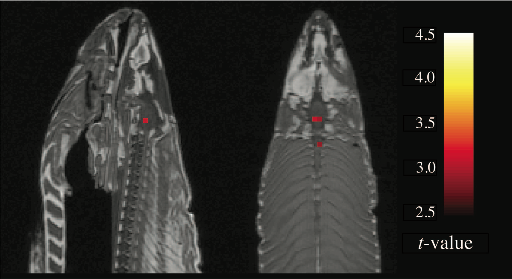
```

* Sagittal/axial slices of significant brain voxels in the task > rest contrast

## Statistical Issues

* Two clusters passed the uncorrected $p$-value threshold of 0.001:
    1. One cluster in the medial brain cavity 
    2. Another cluster in the upper spinal column
* At that time (around 2010), between 25-40% of studies on published fMRI did NOT adjust $p$-values for multiple comparisons
* @bennet2010neural published in Journal of Serendipitous and Unexpected Results

# Summary

## Take Home

* Images are 2 or 3-dimensional **arrays**
* Workflow:
    1. **Extract quantitative features** from images
    2. Statistical summarization, hypothesis testing, ANOVA, clustering and classification
* Common tasks:
    1. **Segmentation**: compute quantitative features not on whole image, but for individual objects
    2. **Spatial statistics**: positions of the objects and how positions relate to each other
    3. **Registration**: In medical image analysis, we usually find transformations between images using  and compare the transformations instead of the images

## References {.allowframebreaks}
