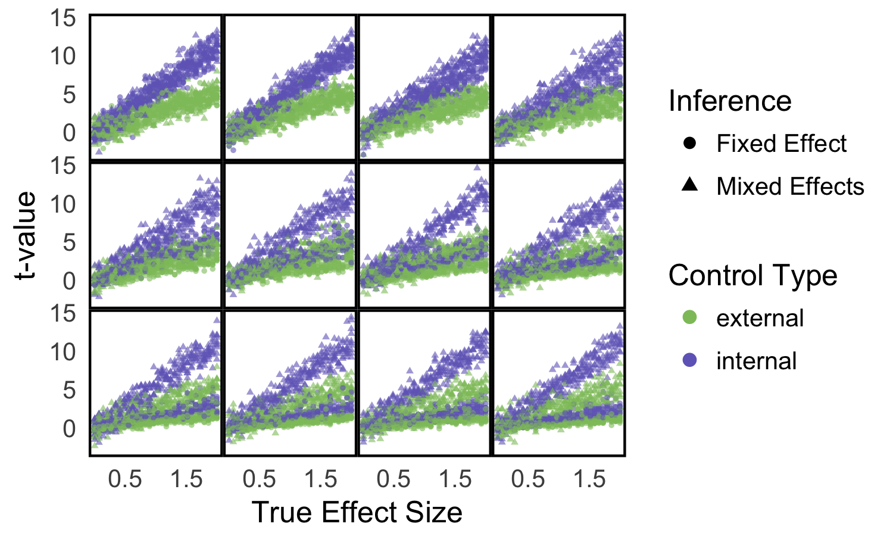

<link href='http://fonts.googleapis.com/css?family=Lato&subset=latin,latin-ext' rel='stylesheet' type='text/css'>

<style type="text/css"> 
.small-code pre code {
  font-size: 1em;
}
body{
  font-family: Lato;
  font-size: 24pt;
}
h1{
  font-family: Lato;
  font-size: 32pt;
  color: #0080FF;
}
h2,h3,h4,h5,h6{
  font-family: Lato;
  font-size: 24pt;
  color: #0080FF;
}
b, strong {
 color: #0080FF;
}

</style>

```{r initialize, echo = FALSE, warning = FALSE}
## Set default options for code chunks
knitr::opts_chunk$set(tidy = FALSE, cache = TRUE, autodep = TRUE,
     dev = "png", dpi = 300,
     size = "small",
     message = FALSE, error = FALSE, warning = TRUE)

## output width
base::options(width = 70,  continue = " ")

## set seed - to have reproducibility
set.seed(0xbedada)
```


# Goals for this Lecture

- Evaluation of the class:

- Question 1: Longitudinal experiments
- Question 2: To rarefy or not ?
- Question 3: Which method : Lasso, ridge, cca, cca2, pca?
- Question 4: Missing values ?
- Question 5: Design for controlled within batch experiment.
- Question 6: DPCoA ?      
- Question 7: Meta-analyses.


# Class Evaluation:


Please send the unique URL below to your students and postdocs on or before the last day of class and inform them of the window of time during which your survey will be open. We strongly encourage you to set aside 10-15 minutes at the end of the last day of class for students to complete the evaluation. This is effective in increasing response rates.
 
Instructions provided by the Office of the Vice Provost for Teaching & Learning: 
 
## BIOS 221 - STATS 366 Course Evaluation

 - Open: 07/14/17
 - Close: 11:59 p.m. on 07/20/17
 - [URL: https://vptleval.stanford.edu/auth/evaluation.php?id=12442](https://vptleval.stanford.edu/auth/evaluation.php?id=12442)
 

The VPTL/Office of Graduate Education do not contact the students directly about course evals.


# Simulating for power calculations....

Example of using some existing R functions from the `pwr` package:

```{r}
library("pwr")
pwr.t.test(n=15,d=0.4,sig.level=0.05,type="two.sample")
pwr.t.test(n=15,d=0.4,sig.level=0.05,type="paired")
pwr.t.test(d=0.4,sig.level=0.05,type="two.sample",power=0.8)
pwr.t.test(d=0.4,sig.level=0.05,type="paired",power=0.8)
```
Some power calculations need more than the sample
and effect size, they alse need the relative size of the 
standard deviation to the mean, called the coefficient of
variation $cv=\sigma/\mu$.

For highthroughput studies such RNA-seq the package
`RNASeqPower` has the same type of input.
However, there are more important quantities
to take into account:
- The depth of sequencing and consequent expected count for a given transcript, argument depth. 
-  The coefficient of variation of counts within each of the two groups, argument cv.     
- The relative expression that we wish to detect $\Delta$, argument effect.
-  The target false positive rate $\alpha$ and false negative rate 
$\beta$ or power $= 1-\beta$, arguments alpha and power.
- The number of samples n in each group, argument n

We often do not know some of the true values for our input
so we do our calculcations at many tentative values, creating
an abaque or grid of possible values within the limits
that we think will cover our experiment:

```{r}
library("RNASeqPower")
rnapower(depth=20, cv=.4, effect=c(1.25, 1.5, 1.75, 2),
             alpha= .05, power=c(.7,.8, .9))
```
```{r}
rnapower(depth=200, cv=.4, effect=c(1.25, 1.5, 1.75, 2),
             alpha= .05, power=c(.7,.8, .9))
```
We see a table of values. 

## Example: prove that it's better to run
##a longitudinal study than a separate control group

Many power simulations cannot be done using these
standard functions because they have the extra levels of complexity
of your specific experimental set-up.


# "Block what you can, randomize what you cannot" 
##  (George Box, 1978)

Special designs: paired, complete block randomized, 

Often we don't know which nuisance factors will be important, or we
cannot plan for them ahead of time. 

In such cases, randomization is a
practical strategy: at least in the limit of large enough sample size,
the effect of any nuisance factor should average out.

## Complete Random Block Design (CRB)
{width="50%"}

## Balanced incomplete Block Design ()
{width="50%"}

## Complete factorial Latin Squares
{width="50%"}


# Randomization decreases bias.

 - Humans are bad at assigning treatments truly at random.  
 - Random assignment reduces unconscious bias 
    (special samples treated differently, balancing things out,..)
 - Randomization also helps with unknown nuisance factors.    

## Randomization helps inference.

 - if the sample is randomly generated from a population, we can infer
   something about the population we drew from.
  
## Random does not mean haphazardly:
 - Need to use a random number generator and a seed.
   

## Identifiability

Suppose we have two possible scenarii and 
we are collecting data to distinguish between them:

Say our observations are the sum of two
normals with unknown means and variances 1:

we see

```{r echo=FALSE}
x1=rnorm(50,1,1)
y1=rnorm(50,3,1)
x1+y1
```

Same observables, different source representations.

Another example ;
a mixture of two binomials:
$$\pi B(2,p_1)+ (1-\pi) B(2, p_2)$$
```{r}
prob=0.7
weights=rbinom(100,size=1,0.7)
bs=rbinom(100,size=2,prob=c(0.3,0.5)[weights+1])
bs
```

We see an overall binomial but have 3 parameters
and only two observations.

Often we can tell that a system is unidentifiable
if there are too many parameters given the amount
of data; that's why adding constraints can solve the problem.


   
# Controls, positive and negative: why?

We often need to remove variation due to unknown factors, or decompose
variability according to its different sources; this is classically done
using analysis of variance and mixed models that can accomodate random
factors such as subject effects and fixed factors such as batch effects.

Usually these decompositions require at least 3 replicate measurements
in each `cell`. 

Removal of effects from unknown sources can only be done
through the use of **negative controls**[^9]. 


Calibration of the effect size in an experiment also requires the use of  **positive controls**; spike-ins  where a known quantity or a known
expression level aid in these calibrations and are a standard part of
many experimental protocols.

Validation in independent data / independent lines of argument

If it is too good to be true, it usually is? An anecdote [^10]

# Power depends on sample sizes, effect sizes and variability.

 - Example of two batches with different variability.
 - Examples of one treatment where the variance is larger.
 - Need to accomodate **heteroscedasticity==unequal variances** with 
 different sample sizes.

# Parametric bootstrap for power simulations:
Power calculations need to be done before an experiment is run. However, when
calculating power one needs to know estimates of quantities such as the
effect size (the difference in means between two treatments) that
will only be known after the experiment. 

The best way to work around
this is to simulate with different possible values of the unknown
parameters to get an idea of the actual sample sizes needed.

Generate data with:

-   same error distribution (shape and moments), taking into all the
    different sources of error that might affect our data

-   various effect sizes

-   various choice of experimental design: sample sizes or number of
    replicates, sequencing depth

To do this, we need to find a parametric family $F_\theta$ that is not
too terrible in modeling our data. Then we estimate $\theta$ from the
data generate whole sets of simulated data from the distribution
$F_{\hat{\theta}}$, while varying effect sizes, sample sizes, levels of
replication, etc.

# Longitudinal Data

Longitudinal data have time as a covariate. The first question is
whether we are looking at a handful of time points -- say, 
the response of
a cell line measured 48h, 72h and 84h after exposure to a drug; or a
long and densely sampled time series such as patch clamp data in
electrophysiology or a movie from life cell microscopy.

In the first case, time is usually best thought of as just another
experimental factor, in the same way as we consider the concentration or
the choice of drug. One analysis strategy could be to first identify the
"best", or biologically most indicative, time point, and then focus on
that. Or we can ask whether there is any effect at all, regardless of
the time. We then just need to make sure that we account for the
dependencies between the measurements over time, and effective sample
sizes. When designing the
experiment, we'll also try to sample more densely at those times when we
expect most to happen.

In the second case, time series, we'll often want to fit dynamical
models to the data. We have many choices:

-   (Hidden) Markov models

-   Change point detection

-   Ordinary differential equations or reaction-diffusion models

-   Piece-wise deterministic stochastic processes

-   Autoregressive models

-   Non-parametric smoothing followed by clustering or classification
    into prototypic shapes


# Effective sample size for dependent data.

 -  Dependent data require **larger** samples
    (less information: the standard errors of mean/median are larger)
    
 - The mean of 64 iid measurements has a smaller standard error than that of
    64 repeated measurements on a same patient (because of their correlation).
    
###Example:
To have a power of 80% to distinguish two groups ($\alpha=0.05$)
one needs samples of size 64 in each group (128 measurements).\\

For two time points that have a correlation of $\rho=0.6$ one needs
a sample of $N=50$ measured twice (ie 200 measurements ).

 -  Equalize the varianceby taking  more samples when higher variability.


{width="60%"}


{width="80%"}

{width="80%"}

# Generalization of the idea of more points close to perturbation

Advanced Techniques

### Response surface design
### Sequential sampling design
### Predefined stopping rules
### Change-point detection


## Incomplete blocks, ragged arrays, missing data.

```{css}
.red { background-color: red; }
Data Imputation...
```


# To rarefy or not?

[pdf link to talk slides](https://www.newton.ac.uk/files/seminar/20140328114512301-153972.pdf)

[Video from Cambridge Newton](https://www.newton.ac.uk/seminar/20140328114512301)

[Subsampling?](http://journals.plos.org/ploscompbiol/article?id=10.1371/journal.pcbi.1003531)

[DESeq for microbiome](http://web.stanford.edu/class/bios221/ExampleMultipleTesting.html)

[Talks](https://spholmes.github.io/2017/03/recent-talks/)

# The problem of too many choices
[Enterotypes](https://www.dropbox.com/s/nkho2nyk1erk0f7/WiDS_RR_Microbiome-2017.pdf?dl=0)

[Enterotypes html](http://statweb.stanford.edu/~susan/papers/EnterotypeRR.html)

# About DPCOA: Double Principal COordinate Analysis

Pavoine, Dufour and Chessel (2004), Purdom (2010) and Fukuyama et al. (2011).

Suppose we have n species in p locations and a matrix $\Delta$ giving the squares of the pairwise distances between the species on the tree (patristic). 
Then we can    
  - Use the distances between species to find an embedding in
$n -1$ -dimensional space such that the euclidean distances between the species is the same as the distances between the species defined in $\Delta$.      
  - Place each of the p locations at the barycenter of its species profile. The euclidean distances between the locations will be the same as the square root of the Rao dissimilarity between them.       
  - Use PCA to find a lower-dimensional representation of the locations.

Give the species and communities coordinates such that the inertia decomposes the same way the diversity does.

## Antibiotic Time Course Data

Measurements of about 2500 different bacterial OTUs from stool samples of three patients (D, E, F)

Each patient sampled $\sim$ 50 times during the course of treatment with ciprofloxacin (an antibiotic).

Times categorized as Pre Cp, 1st Cp, 1st WPC (week post cipro), Interim, 2nd Cp, 2nd WPC, and Post Cp.


## Example

The following code is not live because you have to try it out
interactively, from one extreme DPCOA to the other (weighted PCA).

```{r}
library(adaptiveGPCA)
library(ggplot2)
data(AntibioticPhyloseq)
AntibioticPhyloseq
#theme_set(theme_bw())
#out.ff = gpcaFullFamily(pp$X, pp$Q, k = 2)
#out.agpca = visualizeFullFamily(out.ff, sample_data = sample_data(AntibioticPhyloseq),
#                    sample_mapping = aes(x = Axis1, y = Axis2, color = condition),
#                    var_data = tax_table(AntibioticPhyloseq), var_mapping = aes(x = Axis1, y = Axis2, #color = Phylum))
```

# Meta-Analysis with R

List of all the packages that enable this:
[View of CRAN-packages](https://cran.r-project.org/web/views/MetaAnalysis.html)