# Single-cell RNA-seq

<link href='http://fonts.googleapis.com/css?family=Lato&subset=latin,latin-ext' rel='stylesheet' type='text/css'>

<style type="text/css"> 
.small-code pre code {
  font-size: 1em;
}
body{
  font-family: Lato;
  font-size: 24pt;
  margin-left: auto;
  margin-right: auto;
  line-height: 1.25;
}
h1{
  font-family: Lato;
  font-size: 30pt;
  color: #0080FF;
}
h2,h3,h4,h5,h6{
  font-family: Lato;
  font-size: 24pt;
  color: #0080FF;
}
b, strong{
 color: #0080FF;
}
.main-container{
  max-width: 1800px;
  margin-left: auto;
  margin-right: auto;
  line-height:1.25;
}
</style>

```{r setup, include = FALSE}
knitr::opts_chunk$set(cache = TRUE, error = FALSE, message = FALSE,
                      warning = FALSE, echo = FALSE, results = "hide",
                      fig.align = "center", fig.width = 4.7, fig.height = 3,
                      eval = TRUE)

library("zinbwave")
library("scater")
library("BiocSingular")
library("DelayedArray")
library("dplyr")
library("ggplot2")
theme_set(theme_classic())
BiocParallel::register(BiocParallel::SerialParam())
```

```{r, results="asis", fig.cap="Sandberg, Nature Methods (2014)"}
knitr::include_graphics("img/sandberg.jpg", dpi = 180)
```

# Single-cell signal is noisy

```{r, results="asis", out.width="90%", fig.cap="Owens, Nature (2012)"}
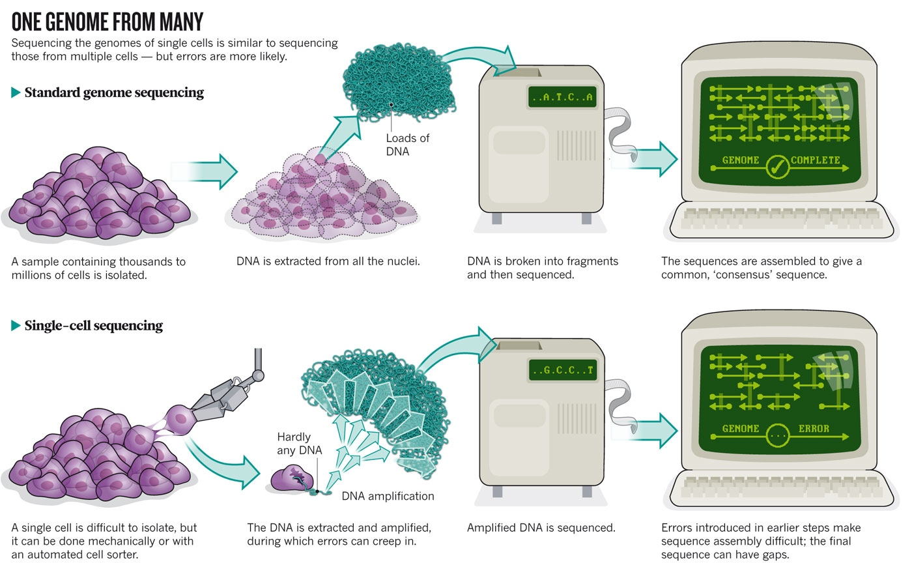
```

# Single-cell data let us ask new questions

```{r, results="asis", out.width="77%",fig.cap="Wagner, Regev, Yosef, Nature Biotechnology (2016)"}
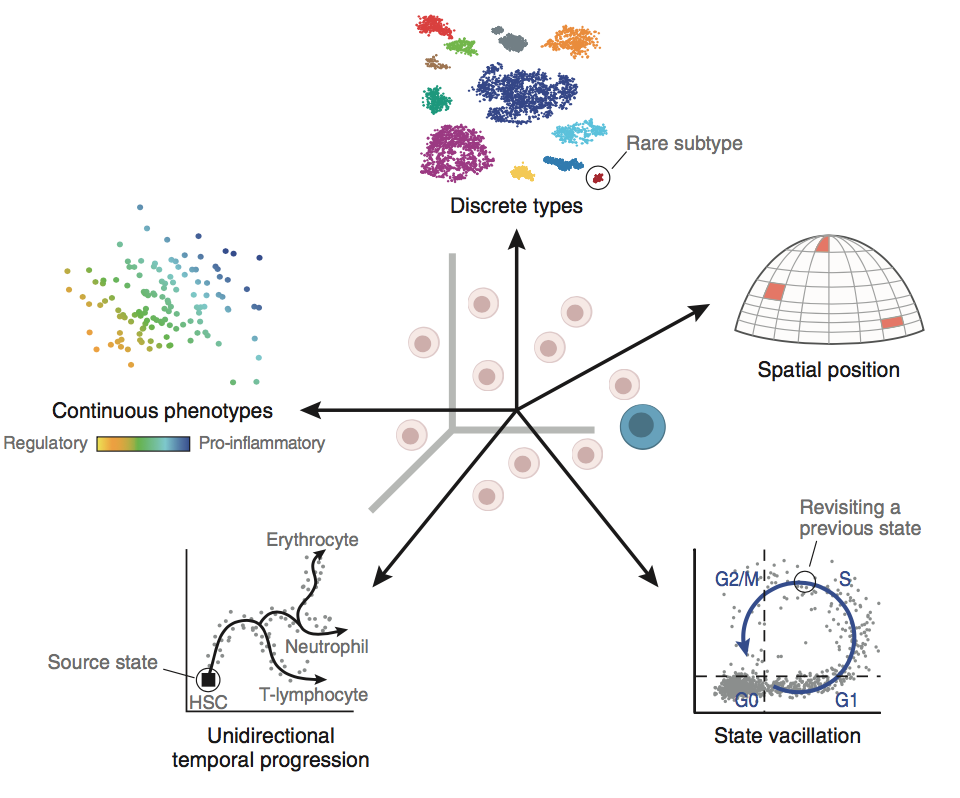
```

# Single-cell data meet big data

```{r, results="asis", out.width="100%", fig.cap="Svensson, Vento-Tormo, Teichmann, Nature Protocols (2018)"}
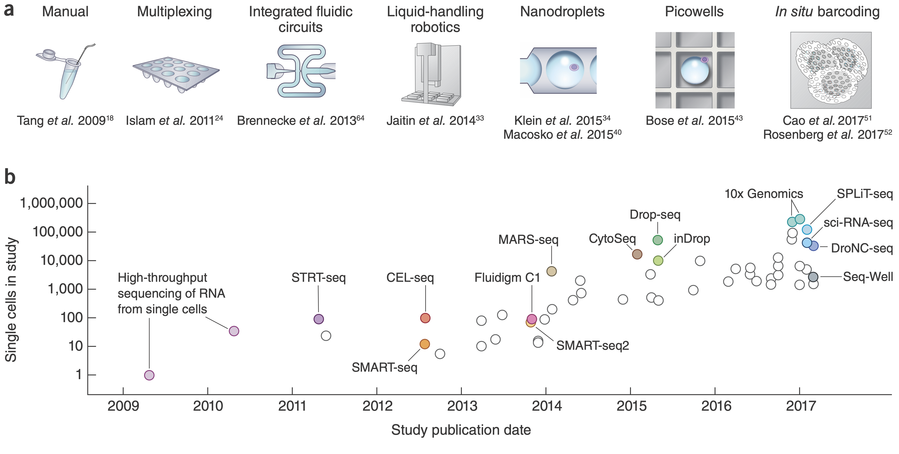
```

# Single-cell meet big data

- BRAIN Initiative "mini" brain atlas

  - 340,000 cells and nuclei from the mouse primary motor cortex
  - Plans to sequence 3M cells for the whole brain (less than $1\%$)

- The Human Cell Atlas "preview" dataset

  - https://preview.data.humancellatlas.org
  - 530,000 cells from umbilical cord blood and bone marrow
  - Millions expected "soon"

```{r logos, eval=FALSE, results="asis", out.width="40%", fig.show="hold"}
knitr::include_graphics(file.path("img", c("Brain.png", "hca.png")))
```
<p align="center">
{ width=34% } 
{ width=40% }
</p>

# A typical workflow

```{r, results="asis", out.width="100%", eval=TRUE, fig.show="hold"}
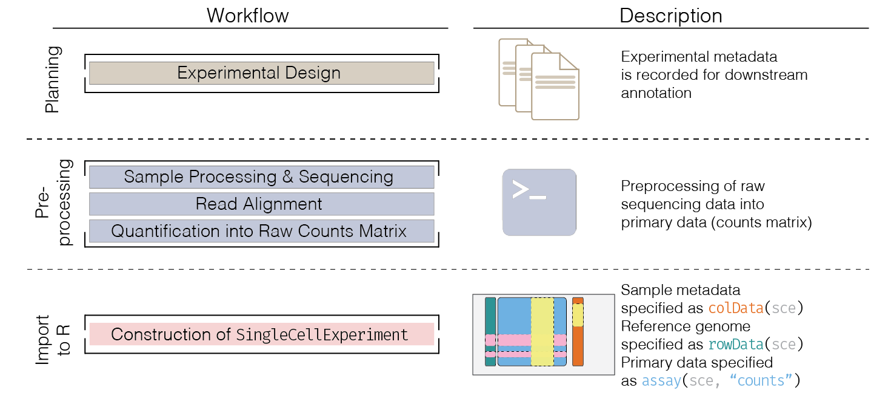
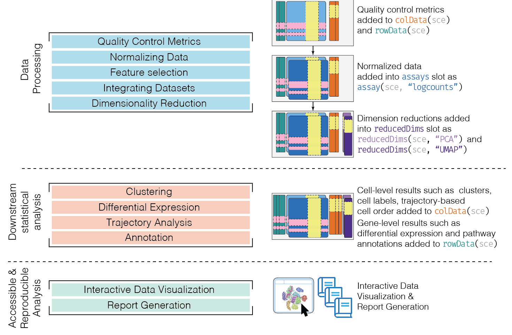
```

# The `SingleCellExperiment` class

```{r, results="asis", out.width="100%"}
knitr::include_graphics("img/sce.png")
```

# The `SingleCellExperiment` class

```{r create_sce}
scefn = "data/sce.rds"
if(!file.exists(scefn)) {
    sce1 = TENxPBMCData::TENxPBMCData("frozen_pbmc_donor_a")
    sce2 = TENxPBMCData::TENxPBMCData("frozen_pbmc_donor_b")
    sce = cbind(sce1, sce2)
    
    ribo_idx = grep("^RPL", rowData(sce)$Symbol)
    mito_idx = grep("^MT", rowData(sce)$Symbol)

    set.seed(244)
    sce = sce[, sample(seq_len(ncol(sce)), 1000)]
    counts(sce) = as.matrix(counts(sce))

    sce = scater::calculateQCMetrics(sce, feature_controls = list(ribo = ribo_idx, mito = mito_idx))
    num_reads = 1
    num_cells = 0.05*ncol(sce)
    keep = which(rowSums(counts(sce) >= num_reads ) >= num_cells)
    sce = sce[keep,]
    
    sce = scater::normalize(sce)

    vars = rowVars(logcounts(sce))
    names(vars) = rownames(sce)
    vars = sort(vars, decreasing = TRUE)
    
    for_pca = t(logcounts(sce)[names(vars)[1:1000],])
    
    pca = BiocSingular::runPCA(for_pca, rank = 10,
                                scale = TRUE,
                                BSPARAM = RandomParam(deferred = FALSE))
    
    reducedDim(sce, "PCA") = pca$x
    # sce = runTSNE(sce, use_dimred = "PCA")
    colnames(sce) = paste0("Cell", seq_len(ncol(sce)))
    sce = zinbsurf(sce, K = 10, X = "~Sample + pct_counts_mito + pct_counts_ribo", 
                   which_genes = names(vars)[1:100])
    
    dir.create("data")
    saveRDS(sce, file=scefn)
} else {
    sce = readRDS(scefn)
}
```

Single-cell RNA-seq data from PBMC cells, generated by 10X Genomics (see .Rmd file for details)

```{r, echo=TRUE, results='markup'}
sce
```

# Resources

- Orchestrating Single-Cell Analysis with Bioconductor -review
  + https://doi.org/10.1101/590562 
  + https://osca.bioconductor.org
- [A step-by-step workflow for low-level analysis of single-cell RNA-seq data with Bioconductor](https://f1000research.com/articles/5-2122/v2)
- [Bioconductor workflow for single-cell RNA sequencing](https://f1000research.com/articles/6-1158/v1)
- [github.com/seandavi/awesome-single-cell](https://github.com/seandavi/awesome-single-cell)
- [scrna-tools.org](https://www.scrna-tools.org)
- [Seurat](https://satijalab.org/seurat)
- [Bioconductor workshop materials](https://bioconductor.org/help/course-materials)

# Bulk vs single-cell RNA-seq

```{r, results="asis", out.width="100%"}
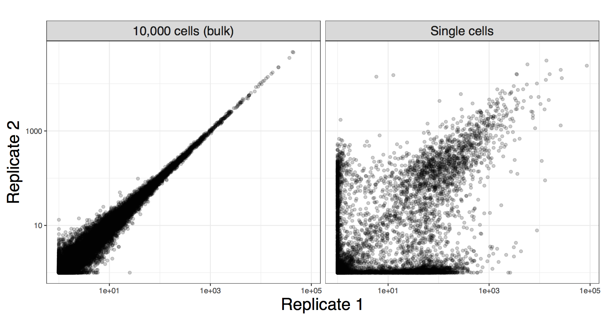
```

# Zero-inflated Gamma Poisson to the rescue?

For $\pi\in[0,1]$, the density of the zero-inflated Gamma-Poisson distribution is
given by

$$
f_{\text{ZIGP}}(y;\mu,\theta, \pi) = \pi \delta_0(y) + (1 - \pi) f_{\text{GP}}(y;\mu,\theta), \quad \forall y\in\mathbb{N},
$$

where $\delta_0(\cdot)$ is the Dirac function. 

Here, $\pi$ is interpreted as the probability that a $0$ is observed instead of the actual count ("dropout"), resulting in an inflation of zeros compared to the GP distribution.

# Single-cell RNA-seq read counts

```{r, results="asis", out.width="100%", fig.cap="Townes et al., bioR$\\chi$iv (2019) https://doi.org/10.1101/574574"}
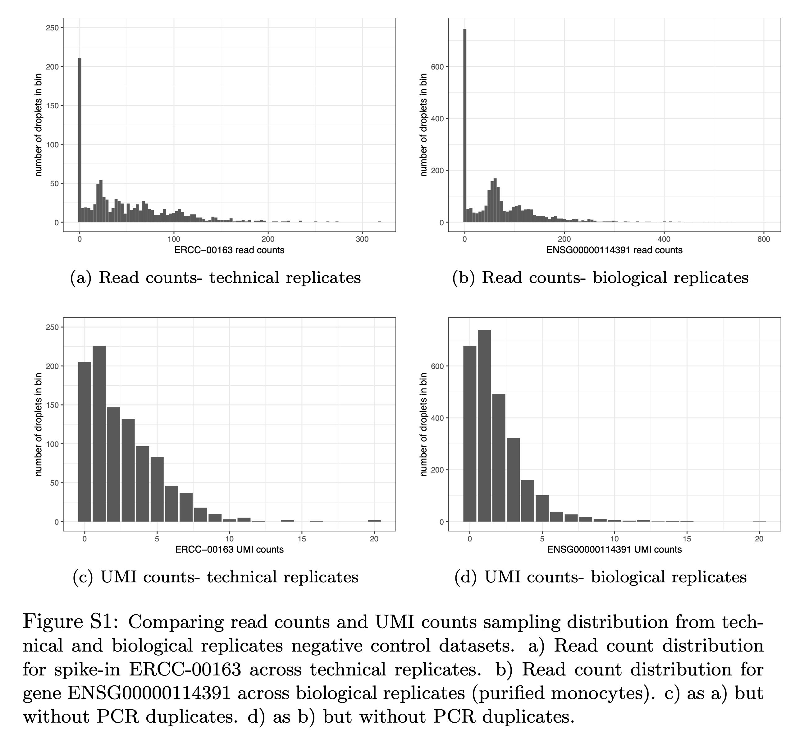
```

# Logarithm transformation is not helpful

```{r, results="asis", out.width="100%"}
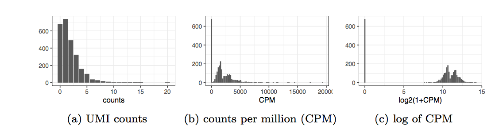
```

# Do we need to account for the extra zeros in the model?

```{r, results="asis", out.width="100%", fig.cap="Svensson (2019), Droplet scRNA-seq is not zero-inflated, bioR$\\chi$iv https://doi.org/10.1101/582064"}
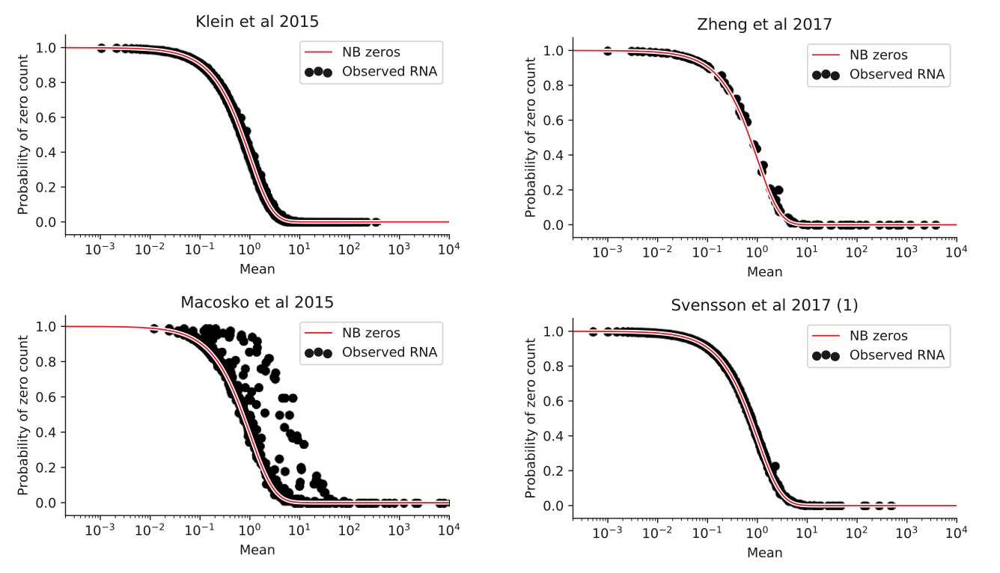
```

# Do we need to account for the extra zeros in the model?

```{r, results="asis", out.width="50%"}
# 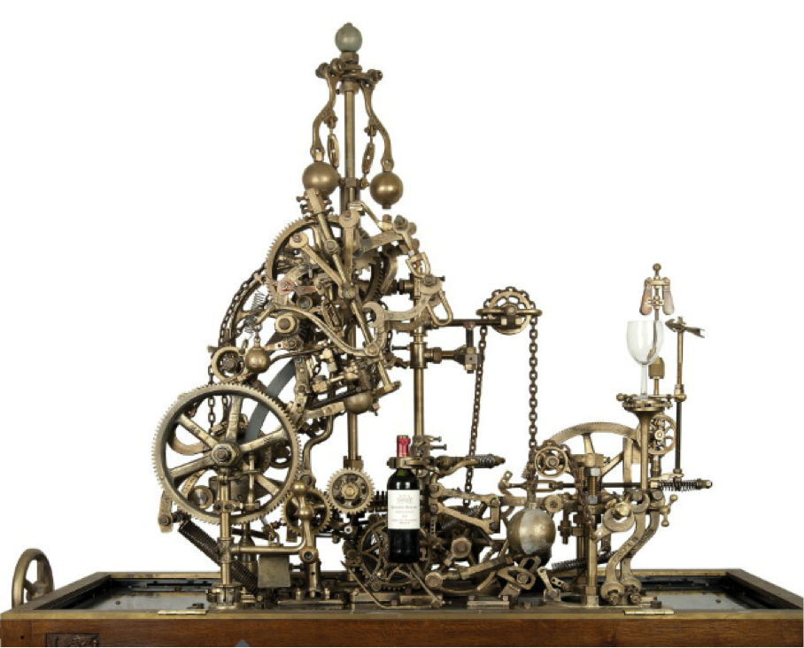

```

In UMI (unique molecular identifiers) data, in particular in droplet-based data, zero-inflation is not an important issue. 

In non-UMI data, the problem are not too many zeros, but too many high numbers (from runaway PCR duplication)

# Naught all zeros in sequence count data are the same

- "..., we find that zero-inflated models ... tend to inflate parameter estimates ... due to inherent identifiability issues."
- "... this parameter inflation can be so severe as to dominate the results of a differential expression analysis..."
- "We find that simpler sampling models are well equipped to perform inference in situations dominated by sampling and biological zeros." 

Silverman, Roche, Mukherjee, David. doi: http://dx.doi.org/10.1101/477794 (paraphrasing what many others had also said before)

# Quality Control and Filtering

```{r, results="asis", out.width="100%"}

```

# Quality Control and Filtering

Exploratory data analysis (EDA) and quality control (QC) are of utmost importance in genomics.

With single cell data we have the luxury of having a large number of samples, hence we can filter out low quality cells as well as poorly sampled (=measured) genes.

There are some simple metrics that we can compute.

[NB: what is quality?](https://en.wikipedia.org/wiki/Quality_(business))

# Identifying empty droplets

```{r, results="asis", out.width="100%", fig.cap="Bioconductor package `DropletUtils`"}
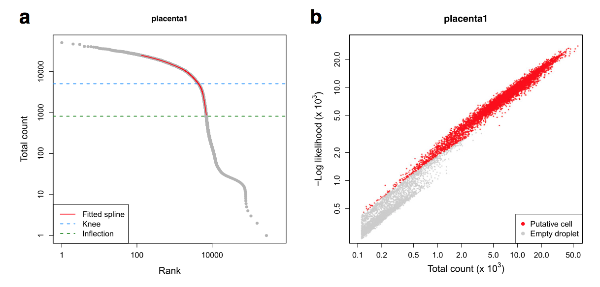
```

# Computing QC metrics

```{r, echo=TRUE, eval=FALSE}
sce = TENxPBMCData::TENxPBMCData("pbmc4k")
sce = scater::calculateQCMetrics(sce)
```

```{r, results="asis", out.width="100%", fig.cap="Filtering genes and samples"}
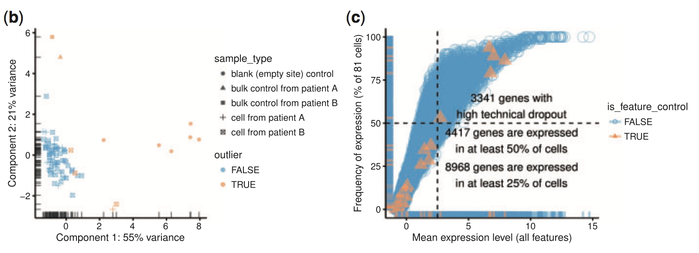
```

# Exploring batch effects

```{r, results="asis", out.width="100%", fig.cap = "Bioconductor package `scone`"}
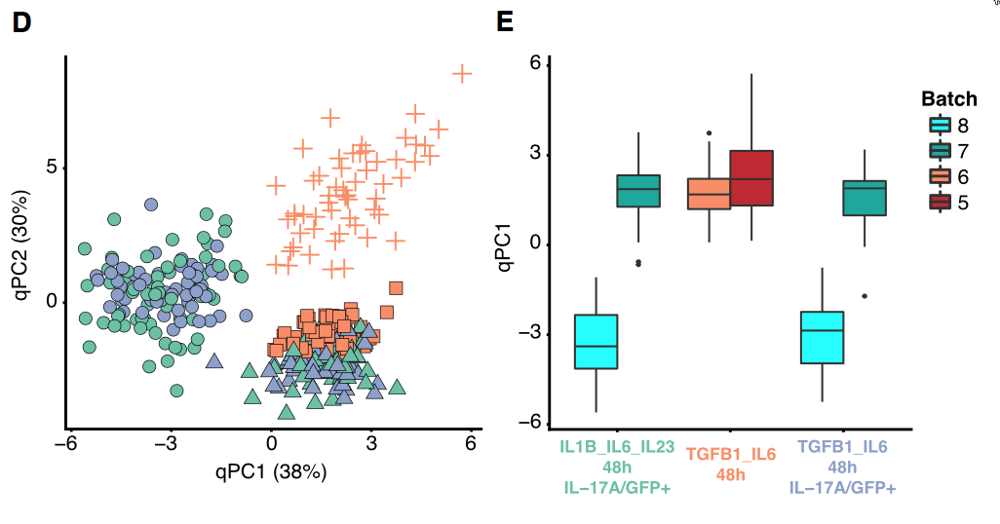
```

# Normalization

```{r, results="asis", out.width="77%"}
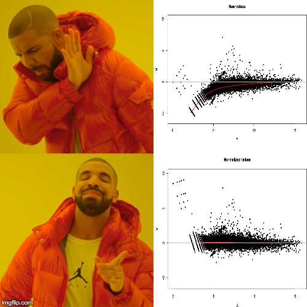
```

# Normalization

As with bulk RNA-seq, it is important to account for the differences in sequencing depth and the other biases that may affect the expression levels.

```{r, results="asis", out.width="100%", fig.cap="Vallejos et al., Nature Methods (2017)"}
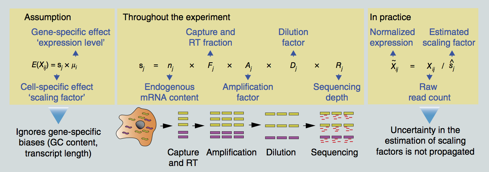
```

# Bulk RNA-seq normalization methods do not always work

```{r, results="asis", out.width="77%", fig.cap="Vallejos et al., Nature Methods (2017)"}
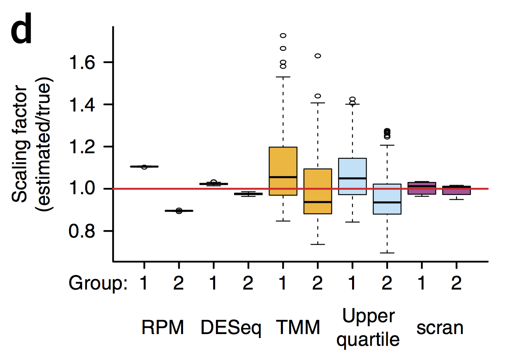
```

# Pooling across cells helps

```{r, results="asis", out.width="90%", fig.cap="Bioconductor package `scran`"}
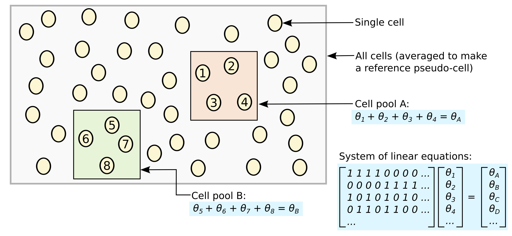
```

# Model-based approach

An alternative is to include normalization as a parameter of the statistical model.

This has the advantage of propagating the uncertainty in the estimation of the scaling factors.

This is the approach of the `BASiCS` and `zinbwave` Bioconductor packages.

# Dimensionality reduction

```{r, results="asis", out.width="77%"}
knitr::include_graphics("img/fuck_grapefruit.png")
```

# Dimensionality reduction

Dimensionality reduction is useful for two related goals

1. _Visualize_ high dimensional data (usually in two dimensions)
    - PCA
    - t-SNE
    - UMAP
    
2. _Infer_ low-dimensional structures from high dimensional data (1--50 dimensions)
    - PCA 
    - Factor analysis (e.g., `MOFA` package https://doi.org/10.15252/msb.20178124)
    - `glmpca` package (CRAN) https://doi.org/10.1101/574574 
    - `ZIFA`, `ZINB-WaVE` (NB caveat about zero-inflation, above)
    
# Sample quality effects visualized by PCA

```{r pcasce, echo = TRUE, fig.dim=c(5,4), out.width = "70%"}
df = tibble(
       PC1 = reducedDim(sce, "PCA")[, 1],
       PC2 = reducedDim(sce, "PCA")[, 2],
       Batch = sce$Sample,
       `log10(total_counts)` = sce$log10_total_counts,
       total_genes = sce$log10_total_features_by_counts)

ggplot(df, aes(x = PC1, y = PC2, color = `log10(total_counts)`)) +
  geom_point(size = .5) + scale_color_continuous(low = "blue", high = "yellow") +
  ggtitle("12K PBMC (10X Genomics)") + coord_fixed()
```

# Batch effects!

```{r batcheffects, echo = TRUE, fig.dim=c(5,4), out.width = "70%"}
pca2 = ggplot(df, aes(x = PC1, y = PC2, color = Batch)) +
  geom_point(size = .5) + scale_color_brewer(palette = "Set1") + 
  coord_fixed() 
pca2 + ggtitle("12K PBMC (10X Genomics)") 
```

# The ZINB-WaVE model

$Y_{ij}$: count of gene $j$ (for $j=1,\ldots,J$) for sample $i$ (for $i=1,\ldots, n$). 

```{r, results="asis", out.width="100%"}
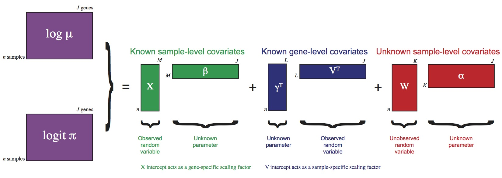
```

# ZINB-WaVE adjusts for batch effects

```{r callzinbwave, eval=FALSE, echo=TRUE}
library("zinbwave")
sce = zinbwave(sce, X = "~batch", K = 10)
```

```{r zinbwavefixesbatcheffects, echo = TRUE, fig.dim=c(10,4), out.width = "100%"}
gridExtra::grid.arrange(
pca2 + ggtitle("before"),
tibble(Z1 = reducedDim(sce, "zinbwave")[,1],
       Z2 = reducedDim(sce, "zinbwave")[,2],
       Batch = sce$Sample) %>%
ggplot(aes(x = Z1, y = Z2, color = Batch)) +
  geom_point(size = .5) + scale_color_brewer(palette = "Set1") +
  ggtitle("after ZINB-WaVE") + coord_fixed(), 
ncol = 2)
```

# GLM-PCA

In droplet-based data, it might be safe to ignore zero inflation.

We could use a simpler "NB-WAVE" model.

Alternatively, we can exploit the fact that the Gamma-Poisson distribution (with known dispersion) belongs to the exponential family.

The GLM-PCA method is a generalization of PCA for the exponential family.

Townes et al. (2019) propose a fast approximation to GLM-PCA based on deviance residuals that is much faster than ZINB-WAVE and gives comparable results: CRAN package `glmpca`, bioR$\chi$iv https://doi.org/10.1101/574574

# Approximate PCA

Even regular PCA is not scalable enough to very large datasets (millions of cells) and approximations are needed.

The `BiocSingular` package provides implementations of the random PCA algorithm and the implicitly restarted Lanczos bidiagonalization algorithm (IRLBA).

# Lineage Inference

```{r, results="asis", out.width="77%"}
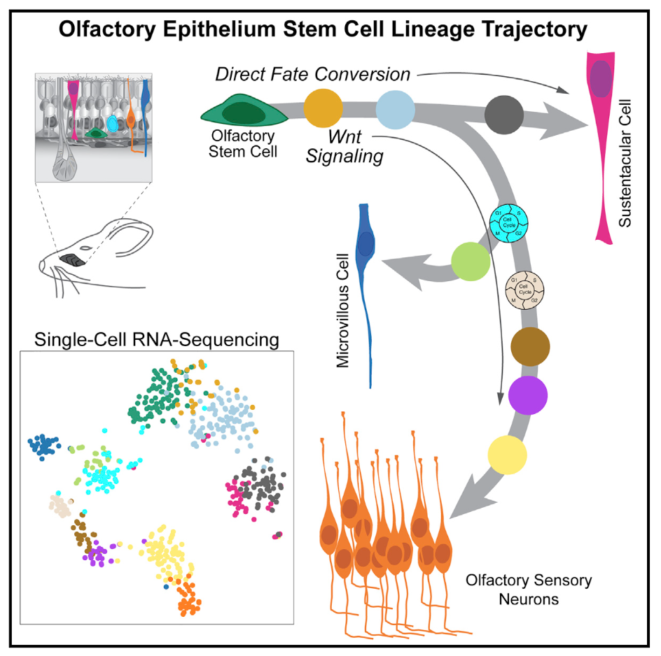
```

# Motivation

```{r, results="asis", out.width="100%"}
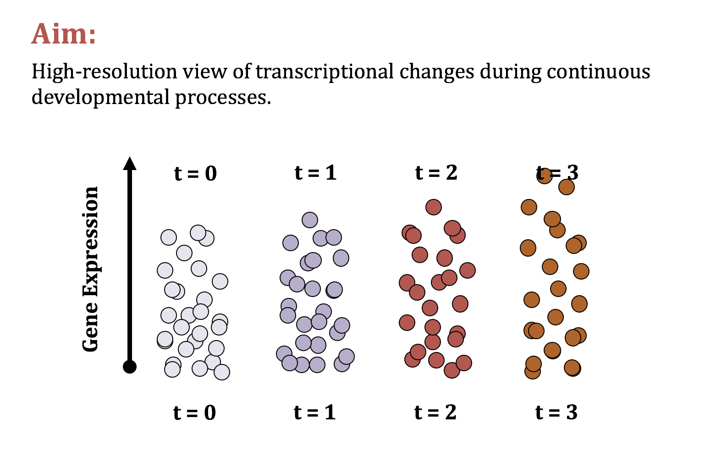
```

# Motivation

```{r, results="asis", out.width="100%"}
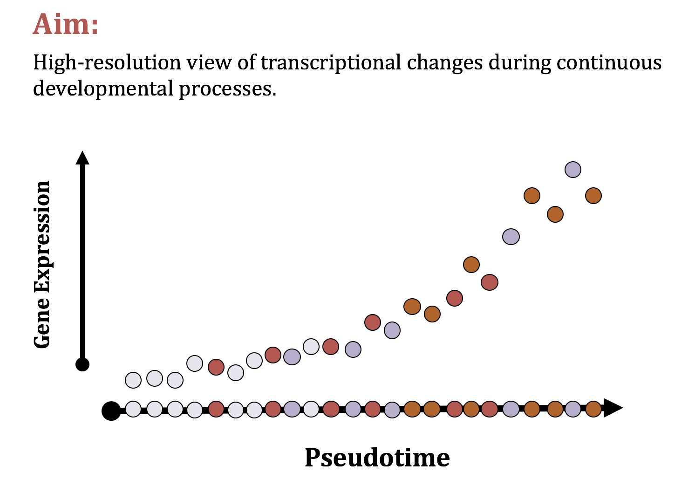
```

# Motivation

```{r, results="asis", out.width="100%"}
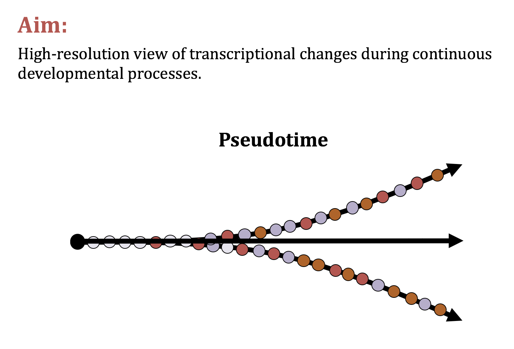
```

# The slingshot algorithm

Street, Risso, ..., Purdom, Dudoit (2018). _Slingshot: cell lineage and pseudotime inference for single-cell transcriptomics_ BMC Genomics, 477 https://doi.org/10.1186/s12864-018-4772-0  :  `slingshot` package on Bioconductor

Start from a representation of the cells in some space defined by their gene expression (usually after dimensionality reduction - NB: horseshoes lecture). Suppose we identified $K$ clusters.

1. Identification of lineages
    - treat clusters as nodes in a graph
    - draw a minimum spanning tree (MST) between the nodes
    - lineages are ordered sets of clusters
    - semi-supervised: set the starting cluster (root of the tree) and optionally a set of known end points (leaves)

2. Draw a "smooth" path through the lineages
    - use of _principal curves_ (Hastie and Stuetzle, 1989)
    - shrink curves together in shared paths (simultaneous principal curves)
    - project each cell onto the principal curve(s) to infer pseudotime

# The slingshot algorithm

```{r, results="asis", out.width="100%", fig.cap="RSEC: Resampling-based Sequential Ensemble Clustering"}
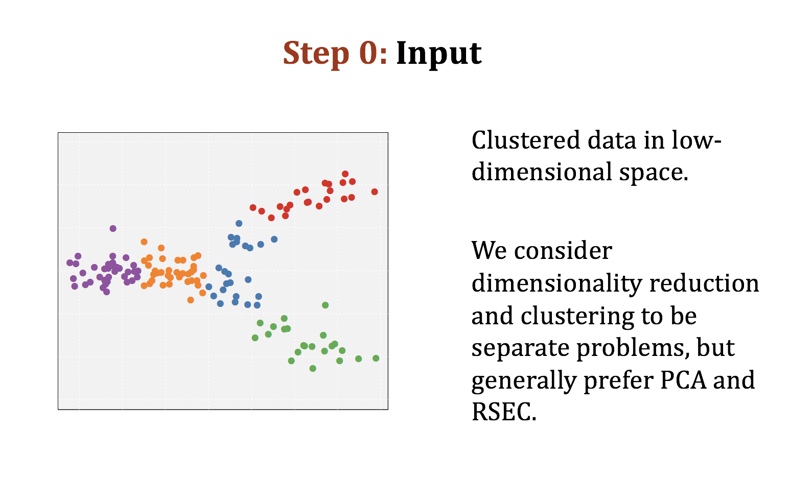
```

# The slingshot algorithm

```{r, results="asis", out.width="100%"}
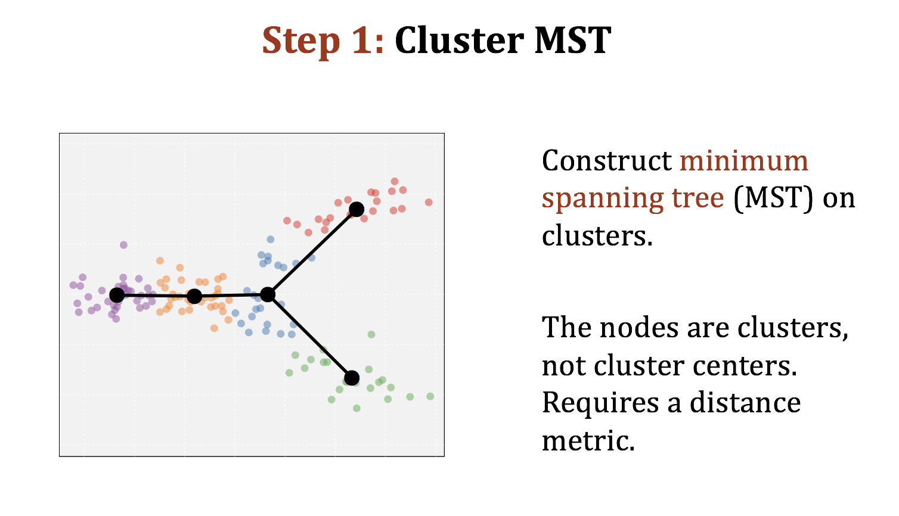
```

# The slingshot algorithm

```{r, results="asis", out.width="100%"}
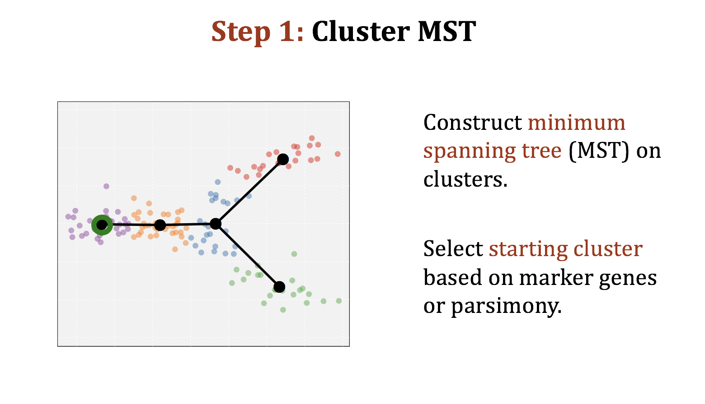
```

# The slingshot algorithm

```{r, results="asis", out.width="100%"}
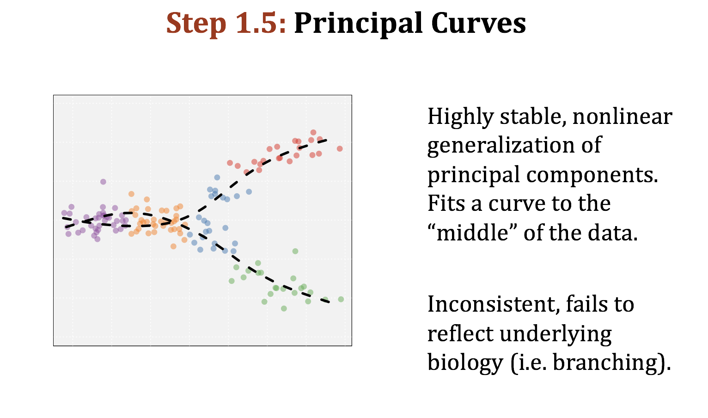
```

# Principal curves

```{r, results="asis", out.width="100%", fig.cap="Hastie and Stuetzle, JASA 1989"}
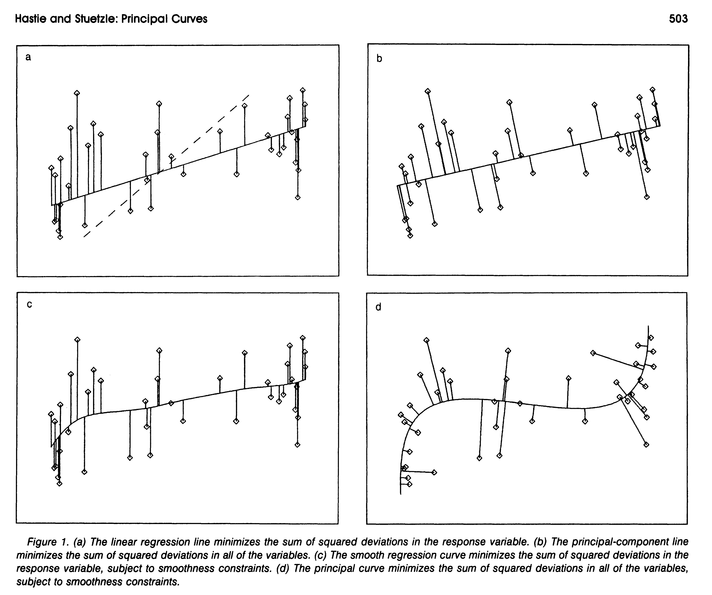
```

# The slingshot algorithm

```{r, results="asis", out.width="100%"}
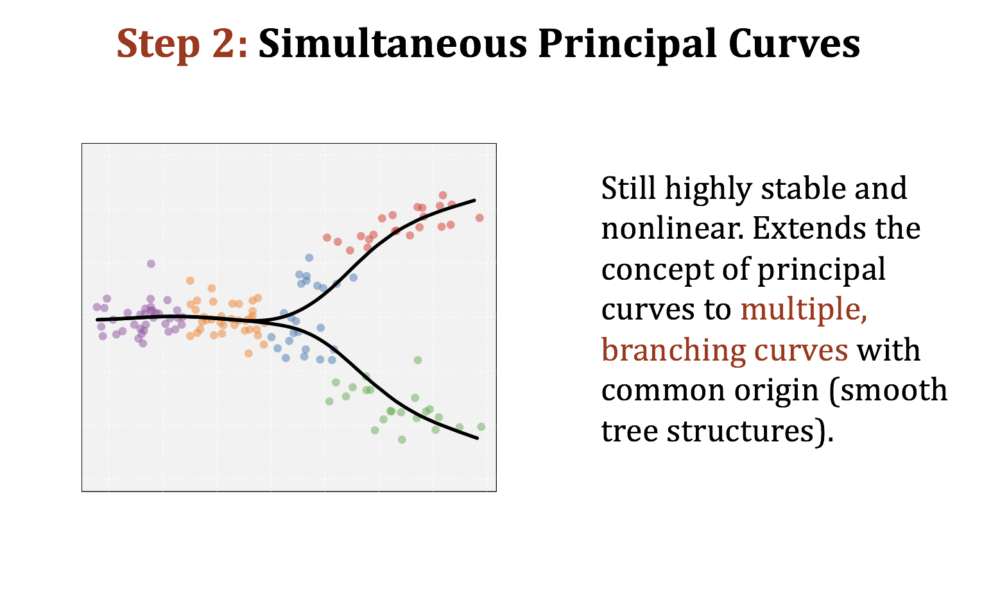
```

# The slingshot algorithm

```{r, results="asis", out.width="100%"}
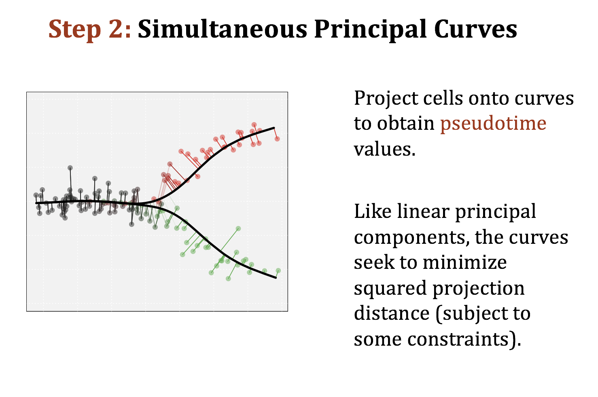
```

# Shape-sensitive distance

Constructing an MST involves specifying a distance measure between nodes.

A Mahalanobis-like distance, i.e., a covariance-scaled Euclidean distance, that accounts for cluster shape, works well in practice.

$$
d^2(\mathcal{C}_i,\mathcal{C}_j) \equiv (\bar{X}_i - \bar{X}_j)^T (S_i + S_j)^{-1} (\bar{X}_i - \bar{X}_j),
$$

# Biological meaningful supervision

Slingshot allows two forms of supervision during lineage identification:

- initial state (root)
- terminal states (leaves)

Like other methods, Slingshot requires the user to identify the _initial cluster_ or _root node_.

Slingshot optionally allows the specification of _terminal cell states_, imposing a _local constraint_ on the MST algorithm.

<!--
# Principal Curves algorithm (Hastie and Stuetzle, 1989)

Iteratively follow these steps:

1. Project all data points onto the curve and calculate the arc length from the beginning of the curve to each point’s projection. Setting the lowest value to zero, this produces pseudotimes.

2. For each dimension $j$, use the cells' pseudotimes to predict their coordinates, typically with a smoothing spline.
    - This produces a set of $J'$ functions which collectively map pseudotime values defining a smooth curve in $J'$ dimensions.

3. Repeat this process until convergence, using the sum of squared distances between cells' actual coordinates and their projections on the curves to determine convergence.
-->

# Simultaneous Principal Curves

To allow for multiple lineages, we modify the principal curves algorithms in two ways:

- We incorporate cell weights to allow cells to contribute differently to different lineages.

- We add a _shrinkage_ procedure to ensure smooth branching events.

The shrinkage is performed by first recursively constructing an average curve for each branching event, then recursively shrinking the branching lineage curves toward this average.

<!--
# Shrinkage

We construct _non-increasing_ curve-specific weights, with $w_m(0) = 1$ (maximum shrinkage)
    - diverging curves always share the same initial point
    
Shrink the diverging curves toward the average curve:

$$
\mathbf{c}_m^\text{new}(t) \equiv w_m(t)\mathbf{c}_{\text{avg}}(t) + (1-w_m(t))\mathbf{c}_m(t).
$$

# The `slingshot` package

```{r, echo=TRUE, eval=FALSE}
library(slingshot)
ce = slingshot(ce, reducedDim = "MDS", start.clus = "c1")
```
-->

# Acknowedgements

Davide Risso
(University of Padova)

Twitter: \texttt{@risso1893}
Github: \texttt{github.com/drisso}


```{r, results="asis", out.width="50%", eval=TRUE}

```

# Extrapolation

```{r, results="asis", out.width="77%"}
knitr::include_graphics("img/extrapolating.png")
```

# Random fortune cookie

```{r fortune, echo = TRUE, results = "asis"}
fortunes::fortune(floor(exp(exp(pi/2))))
```