```{r setup, include=FALSE}
knitr::opts_chunk$set(echo = TRUE)
```

# Watch the video for Rstudio

The purpose of this lab is to familiarize yourself with Rmarkdown -- an extremely useful tool to generate reports.

Start by watching the videos associated to this lecture:

a) [The basics of Rmarkdown](https://www.youtube.com/watch?v=tKUufzpoHDE)
b) [A more comprehensive Rmarkdown video](https://www.youtube.com/watch?v=MGWtn5-CFFI)
c) [Importing data](https://www.youtube.com/watch?v=qK1ElUMkhq0&list=PLOU2XLYxmsIK9qQfztXeybpHvru-TrqAP&index=8) -- you should already have watched this one for the previous discussion.

# R and RStudio

This lab will help you learn how to use RStudio as part of your analysis. You will learn how to use and update RStudio, as well as how to obtain R-packages, and makes sure you have
right versions of the software.


## Getting RStudio

**RStudio is an IDE** (Integrated Development Environment) for R. It provides
you with a powerful interface for working with R, which includes a 
**text editor** where you can write your code and/or notes.

You should have installed R -Studio during the first discussion --- if you have, skip over to the next section. Otherwise, follow the instructions underneath.

To get RStudio go to [https://rstudio.com/products/rstudio/download/#download](https://www.rstudio.com/products/rstudio/download/#download)
and download a free version by clicking the blue button 
'DOWNLOAD' below the "RStudio Desktop" column (free) and then choosing the file appropriate for your OS. 
Open the file and follow the instructions.
<br><br>
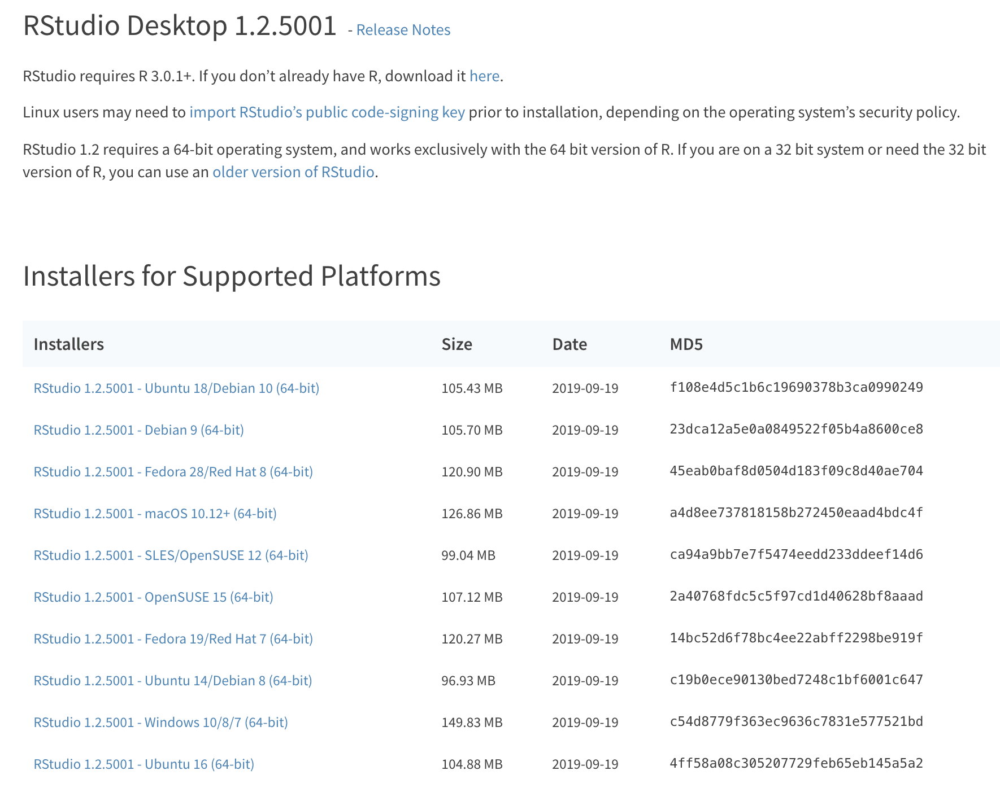

<br>

If you encounter issues with or need more detailed guidance on the installation 
process, please read [the DataCamp tutorial](https://www.datacamp.com/community/tutorials/installing-R-windows-mac-ubuntu) 
and watch included videos which include step-by-step instructions for each
of the three operating systems. If problems persist, please ask one of the TAs 
for assistance.


To test whether the installation of R and RStudio was successful, open RStudio
and in the Console tab, type in a simple arithmetic calculation e.g.:

```{r, eval = FALSE}
1+1
2^3
```

to see if the commands execute and the results are correct.


# R packages

R is a extensible system which allows code contribution from its users in form
of R-*packages*. The packages are deposited on reporsitories such as 
[CRAN](https://cran.r-project.org/), [Bioconductor](http://bioconductor.org/) 
or [GitHub](https://github.com/).

## CRAN

CRAN, *Comprehensive R Archive Network* is a location where you can download 
both R and its packages. The repository stores the core set of packages,
which are included by default with the R installation. As of today,
there are more than 14,900 packages on CRAN.

To install a package from CRAN, e.g. \texttt{tidyverse} simply type in the
following command into R-console:

```{r, eval = FALSE}
install.packages("tidyverse", dependencies = TRUE)
```


Using the argument `dependencies = TRUE`, we are being explicit and 
extra-careful to install any additional packages the target package, 
`tidyverse` requires.

You can then load a package using the `library` command:
```{r, eval=FALSE}
library("tidyverse")
```

Please, check if you have the latest versions of `knitr` (1.25) 
and `rmarkdown` (1.15) packages installed on your system. If not,
use the installation commands as the one above to install the two packages.
These two packages include utilities for generating R documents.

For example, you can check this as follows:

```{r, eval=FALSE}
packageVersion("rmarkdown")
```

## Bioconductor

[**Bioconductor**](http://bioconductor.org/about/), is another open source 
project devoted to providing tools for the analysis and exploration of 
high-throughput genomic data. On this repository you will find many packages 
developed for statistical analysis and visualization of biological data.

The most current release of Bioconductor is 3.9 which works with R 3.6.
Please, make sure that you update both R and Bioconductor for this class.

To get the latest version of Bioconductor, your need to first make sure
you have the latest release of R (3.6). To check what version of R you have,
execute the following command in the R-console (make sure is says
at least 3.6):

```{r}
R.Version()$version.string
```


Then, to obtain Bioconductor packages, run the following code again from the console:

```{r, eval = FALSE}
if (!requireNamespace("BiocManager", quietly = TRUE))
    install.packages("BiocManager")
```


Once, you have Bioconductor, its packages can be installed with the following 
command: `BiocManager::install("package_name")`. For example, to install a package
called `GenomicFeatures` you call:


```{r, eval = FALSE}
BiocManager::install("GenomicFeatures")
```

You can install multiple packages at once by providing a vector
of package names e.g.

```{r, eval=FALSE}
BiocManager::install(c("GenomicFeatures", "AnnotationDbi", "Biostrings"))
```

You can check this worked by trying to load these packages:

```{r, eval=FALSE}
library("GenomicFeatures")
```

Furthermore, for our next Lab, we will need the *C.elegans* genome, which can also be downloaded from Bioconductor:
```{r, eval=FALSE}
BiocManager::install("BSgenome.Celegans.UCSC.ce2")
```

Try loading it just as any other R package:

```{r, eval=FALSE}
library("BSgenome.Celegans.UCSC.ce2")
```

If the above worked you can now access the genome (but do not worry about details, we will get to these in the next lab):

```{r, eval=FALSE}
Celegans
```


## [Optional] GitHub

Many developers upload their R code on [GitHub](https://github.com/).
In a lot of the cases, developers upload the latest version 
ther packages changes on GitHub. The development
version contains the most recent changes, but this also means that the code is
not fully tested and might contain bugs. Thus, the GitHub packages should
be used with care.

To be able to access and install R-packages on github you first need to 
install `devtools` package from CRAN:

```{r, eval = FALSE}
install.packages("devtools")
```
Then, you can install packages e.g. the `beyonce` package for additional R colour palettes, using the following code:

```{r, eval=FALSE}
# first load devtools package into memory
library(devtools)
# then, install a package using a package URL address
install_github("dill/beyonce")
```

Note, that you need to provide the `install_github()` function the repository name of
the package you would like to install in the format username/repo, e.g. for [https://github.com/dill/beyonce](https://github.com/dill/beyonce) we used the argument `"dill/beyonce"`.


# R document types

RStudio incorporates a very user-friendly text editor. Using this program
you can type regular text, e.g. notes and comments as well as write, 
debug and execute your R code. The `rmarkdown` and `knitr` packages allow
you to render/convert your R files into '.pdf' or '.html' output formats.
Many [books](https://bookdown.org/) have been written with R markdown, 
including the textbook you will be using for BIOS221. 

## R Scripts

When writing an R program, or any longer set of commands, you should not
type you code directly into the console for immediate execution. Instead,
you should gather all your code (with comments) in a document. The simplest way to do that is to save your program as a R-script, which is 
basically a text file storing all your R code. 

To start a new R-script, press a black triangle dropdown button
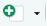 in the top-left corner of your RStudio window. 
You will see multiple options of file formats to choose from, like in 
the picture below:

<br>
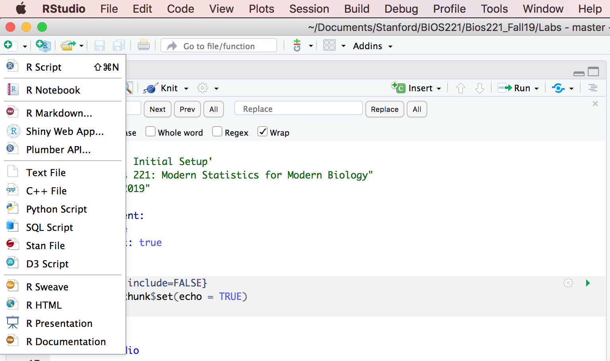
<br><br>

Choose the first option `R Script`. You will see a new, source code panel, with
a tab `Untitled1` appear on top of your R console. In this panel, you
can write and edit your R code. 

Now, type in a few lines of simple code into `Untitled1`, e.g.

```{r, eval=FALSE}
x <- seq(0, 10, length.out = 1000)
y <- x*sin(2*pi*x)
plot(x, y)
```

To execute your code, highlight the portion you want to evaluate and then press the `Run` button on the top-right corner
of your panel, like the one marked with green circle in the image below.
Alternatively, your can be evaluate your code by highlighting it and then 
pressing a keyboard shortcut `Ctrl` (`Command` on macOS X) + `Enter`.

To save your code, press the floppy disk button like the one marked with
a red circle in the image below. Pick a location and a name for your file,
and press `Save`. Your R-script file will have an extention '.R' to indicate
it contains R code. 

<br>
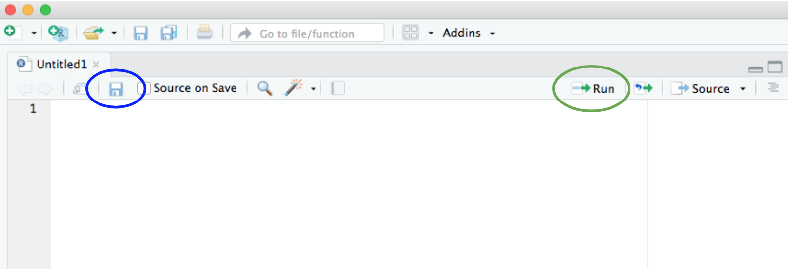
<br><br>

R programs saved as an R-script file can be executed from the R console or another R script with the function `source("my_r_file.R")` and can also be executed 
from a command line. To run your stored e.g. in a file named `my_r_file.R` 
you simply type the following into your terminal: `Rscript my_r_file.R`.

## R Markdown

Another type of file you can edit in RStudio is R Markdown. 
Using R Markdown you can generate reports which combine your notes,
and comments (regular text) together with R code and its outputs 
(e.g. computed values, statistics, and plots). R Markdown facilitates
reproducible research, as you can save the entire data analysis 
process (including all data transformation and normalization steps,
and choices of parameters used for statistical methods) in a sigle report, 
and then share it with your collaborators. This document allows other people 
to reproduce your analysis and obtain the same results.

R Markdown supports a number of static and dynamic output formats, including
[HTML](https://rmarkdown.rstudio.com/html_document_format.html),
[PDF](https://rmarkdown.rstudio.com/pdf_document_format.html), 
[MS Word](https://rmarkdown.rstudio.com/word_document_format.html), 
[Beamer Presentations](https://rmarkdown.rstudio.com/beamer_presentation_format.html),
[shiny applications](https://rmarkdown.rstudio.com/authoring_shiny.html),
even [books](https://bookdown.org/) and [websites](https://rmarkdown.rstudio.com/rmarkdown_websites.html).

To start working on a R Markdown file, again press the dropdown button
 as you did for the R scripts,
but instead select `R Markdown` option. You will see the following window
appear:

<br>
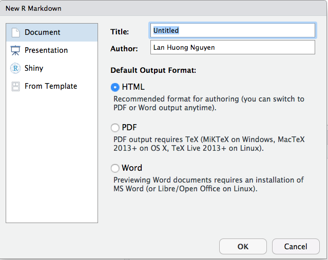
<br><br>

Fill in the `Title` and `Author` field, choose the output format 
('HTML/PDG/Word'), and then press 'OK'. You will notice a new tab 'Untitled1' 
in the source code panel appear, just like in the image below:


<br>
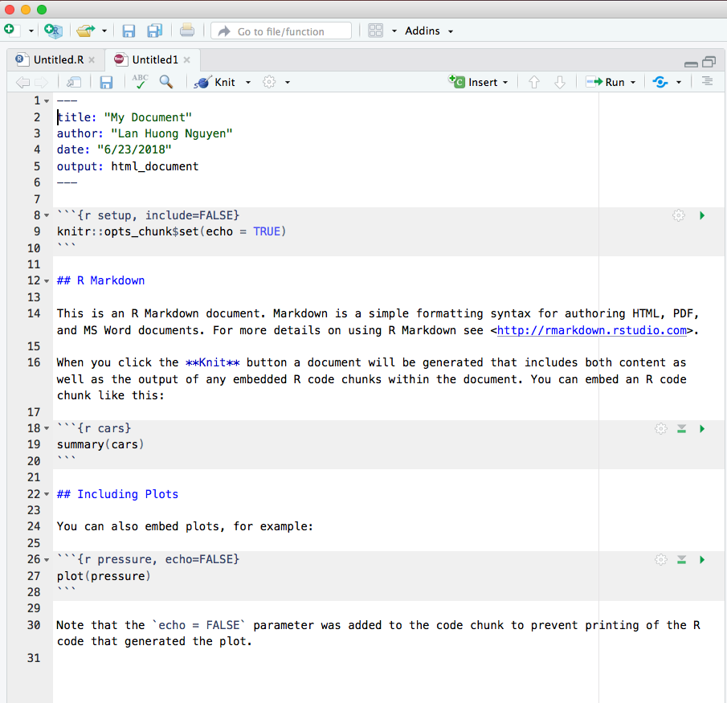
<br><br>

This is your new R Markdown file, with a '.Rmd' extension. 
Note, that the document starts with the 'front-matter', which specifies
the title, author, date and the output format for your document:

<br>
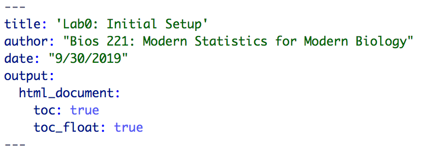
<br><br>

Below the front matter, a few default examples are included. Before
deleting them, note that R Markdown format is similar to
the traditional [markdown format](https://www.markdownguide.org/). 

* section titles/headers are marked with a '#' symbol. You can use
multiple hashtags e.g. '##' of '###' to obtain the size of the header you
want (more hashtags means smaller fonts). 

* regular text can be freely added as in standard text editors (just like
in MS Word).

* R code should be added inside 
the [code chunks](https://rmarkdown.rstudio.com/lesson-3.html), i.e.
should be separated from the text with the chunk delimiters ` ```{r} ` 
and ` ``` `.

You can learn more about R Markdown formatting in this [guide](https://rmarkdown.rstudio.com/html_document_format.html). RStudio also provides a cheatsheet for R Markdown, which you can access from RStudio by navigating to "Help > Cheatsheets > R Markdown Cheat Sheet".

**To insert a new code chunk** into your file you can:

* type in the chunk delimiters: ` ```{r} ` and ` ``` `
* use the keyboard shortcut `Ctrl` + `Alt` + `I` 
(for macOS X: `Command` + `Option` + `I`)
* press the  button in the editor toolbar.

You can play with the current document, add more text delete or/and add
more code chunks. 

**To render your '.Rmd' file**, press
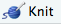 in the editor toolbar on the top of the source code 
panel. A new window will open, where you should set the location
and name of your new '.Rmd' file. Your output document will be generated,
and saved in the same location as your '.Rmd' file. 
Note that, you can choose a different output format from the dropdown
list of :

<br>
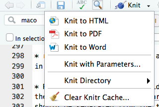
<br>

Your new choice of output (HTML/PDF/Word) format will be reflected in
the front-matter of the '.Rmd' file.

To learn more about how to work with R Markdown documents, visit
this [website](https://rmarkdown.rstudio.com/lesson-1.html).


## R Notebook

[R Notebooks](https://rmarkdown.rstudio.com/r_notebooks.html) are a new feature
of RStudio (only available in version 1.0 or higher). R Notebooks are 
essentially R Markdown documents, but with the output automatically generated.
Whenever you start and save a new R Notebook, two files are generated
-- one with '.Rmd' and the other with '.nb.html' extension. 
The first holds your text and code (same as R Markdow), the second stores 
the output.

**The '.nb.html' is automatically updated** i.e. whenever you run a code chunk 
using 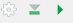 the output will be immediately altered and 
reflected in the '.nb.html' without having to render the entire document using ).

Note that for R notebooks, the output field in the front-matter will be 
*html_notebook*:

<br>
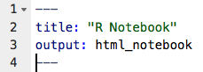

<br>

More on R Notebooks can be found [here](https://rmarkdown.rstudio.com/r_notebooks.html).


# Importing data

We have seen how we can generate reports, our environment is set up and we know how ww will keep track of all the data analysis that we do using Rmarkdown --- all we need to import an actual dataset! Let us now see how we can import and save data.

## Working Directory

- The **current working directory** (cmd) is the location
which R is currently pointing to.

- Whenever you try to read or save a file without specifying 
the path explicitly, the cmd will be used by default.

- When are executing code from an R markdown/notebook code chunk, 
the cmd is **the location of the document**.

- To see the current working directory use `getwd()`:
```{r}
getwd()   # with no arguments
```

- To change the working directory use `setwd(path_name)` 
with a specified path as na argument:
```{r eval = FALSE}
setwd("path/to/directory")
```


## Paths and directory names

- R inherits its file and folder **naming conventions from unix**, and 
uses forward slashes for the directories, e.g. `/home/cdonnat/folder/`

- This is, because backslashes serve a different purpose; they are used as 
escape characters to isolate special characters and stop them from being 
immediately interpreted.

- When working with R on **Windows**, you can use either: `C:/Path/To/A/File`
or `C:\\Path\\To\\A\\File`

-  Use a "`Tab`" for autocompletion to find file paths more easily. 

- To avoid problems, directory names should NOT contain spaces and special characters.


## Importing text data

- **Text Files in a table format** can be read and saved 
to a selected variable using a `read.table()` function.
Use `?read.table` to learn more about the function.

- A common text file format is a **comma delimited text file**,
`.csv`. These files use a comma as column separators, e.g:

```{r eval = FALSE}
Year,Student,Major
2009, John Doe,Statistics
2009, Bart Simpson, Mathematics I
```

- To read these files use the following command:

```{r eval=FALSE}
mydata <- read.table("path/to/filename.csv", header=TRUE,  sep = ",")

# read.csv() has covenient argument defaults for '.csv' files
mydata <- read.csv("path/to/filename.csv")
```

- Optionally, use `row.names` or `col.names` arguments
to set the row and column names.


## Saving data

To save data, you have two options:
 
- Save a table as a csv documents, using:

```{r, eval=FALSE}
write.csv("path/to/filename.csv")
```

- Save a list of object as an RData file:
```{r, eval=FALSE}
list2save = list(obj1 = obj, obj2 = thing) ### the left hand of the inequality is the name of the object, the right hand, the object itself
save("path/to/filename.csv", list2save)
### To load (you'll be then able to have access to the list2save object.)
load("path/to/filename.RData")
### e.,g, to have access to "thing", simply call : list2save$obj2
```

- Save the whole image (all the environment)
```{r, eval=FALSE}
save.image("path/to/filename.RData")
```
# Exercises: To Complete before the discussion on Thursday!!!

We will now put all the pieces of what we've seen during the week together.
Generate an R-markdown document to complete the following exercise:

1. Download the template from the website (supplementary material associated to Lab 3: Week 1 session 3)
2. Name the Markdown document (in the title section) "Lab 3" and check that the output is a pdf document.
3. Complete the exercises in the template.
4. When you're done, "knit" your pdf and send it to the course instructor with "Bootcamp: Lab3" in the email object.

