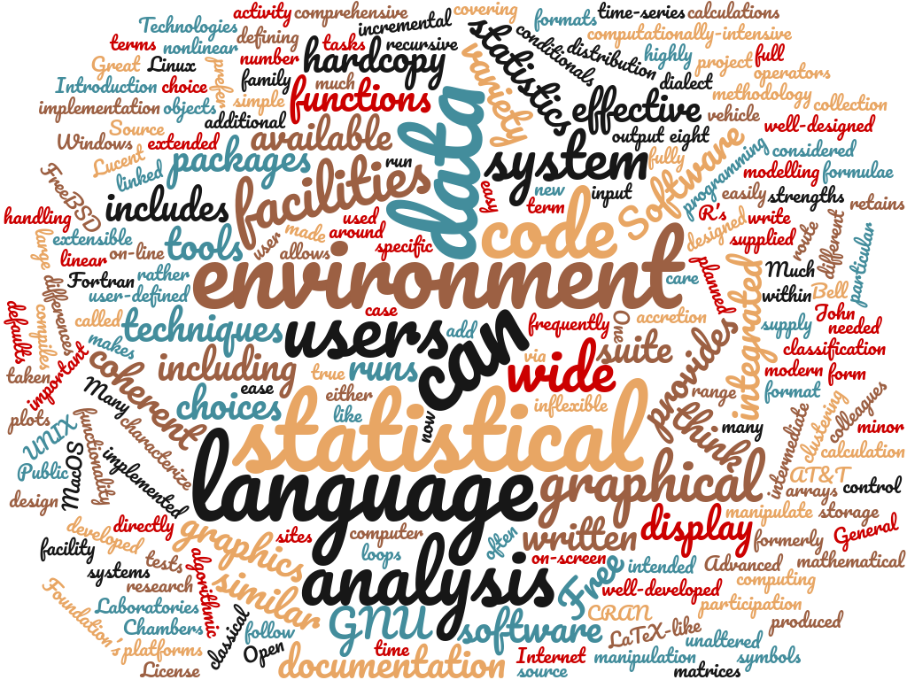
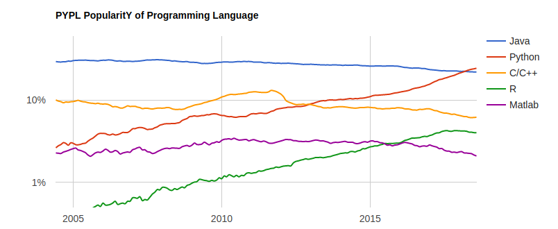
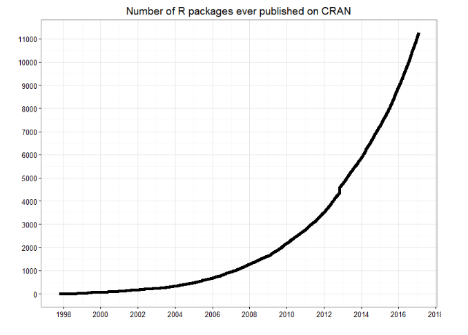
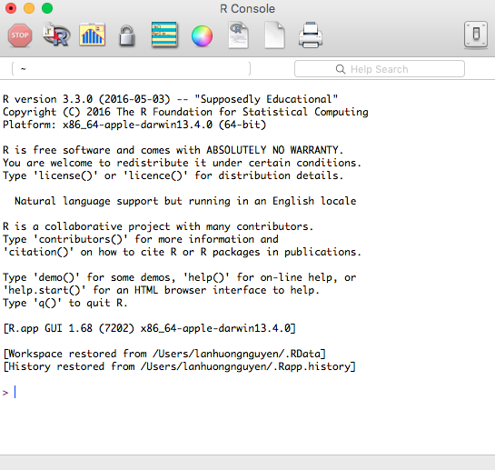
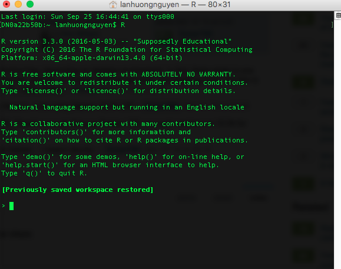
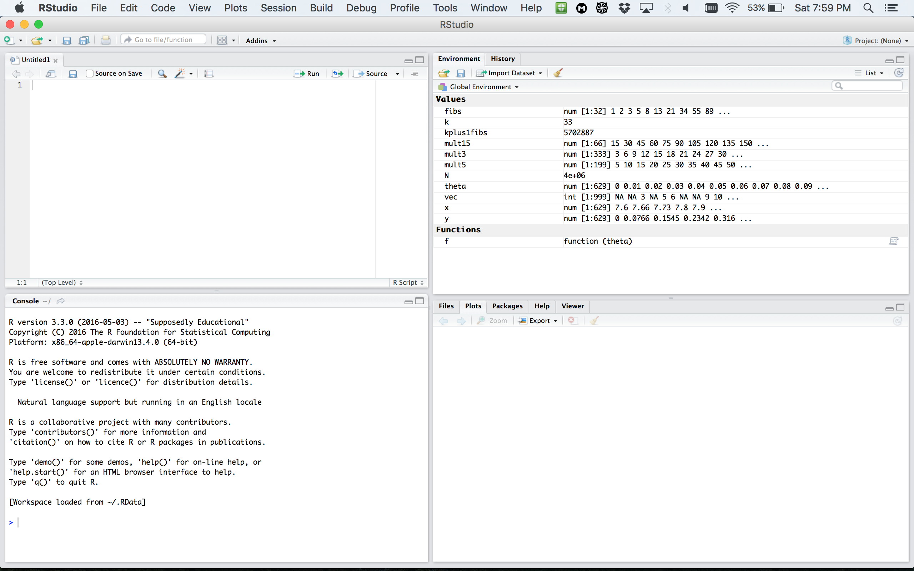
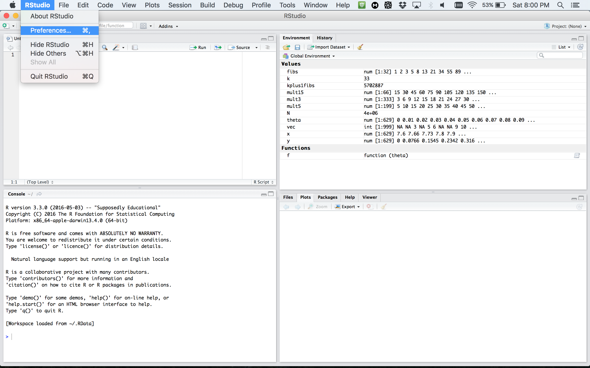
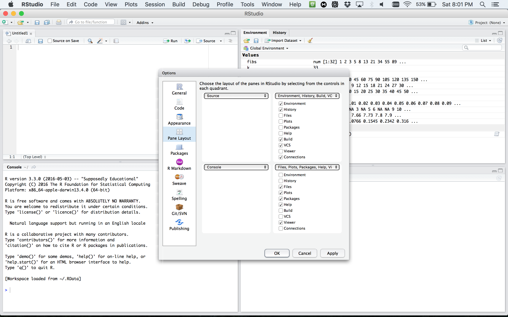
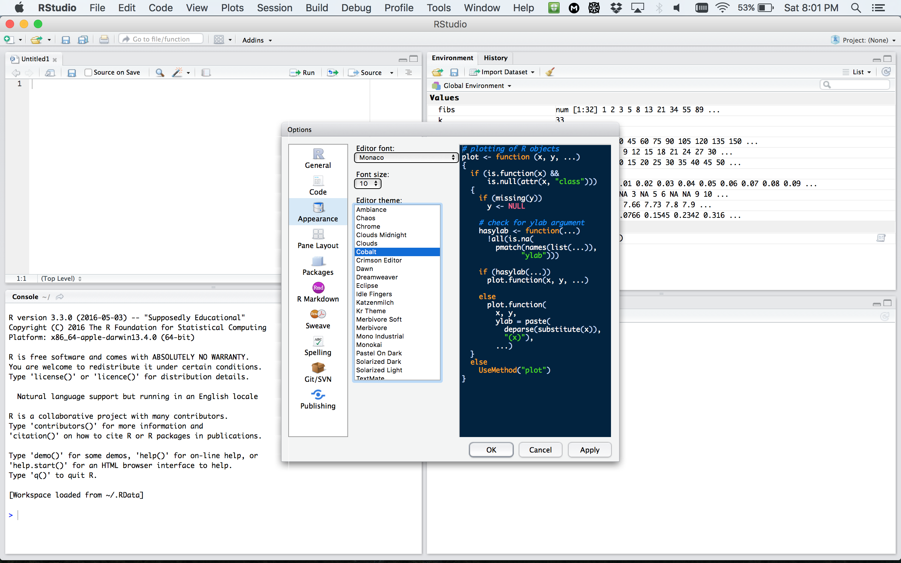
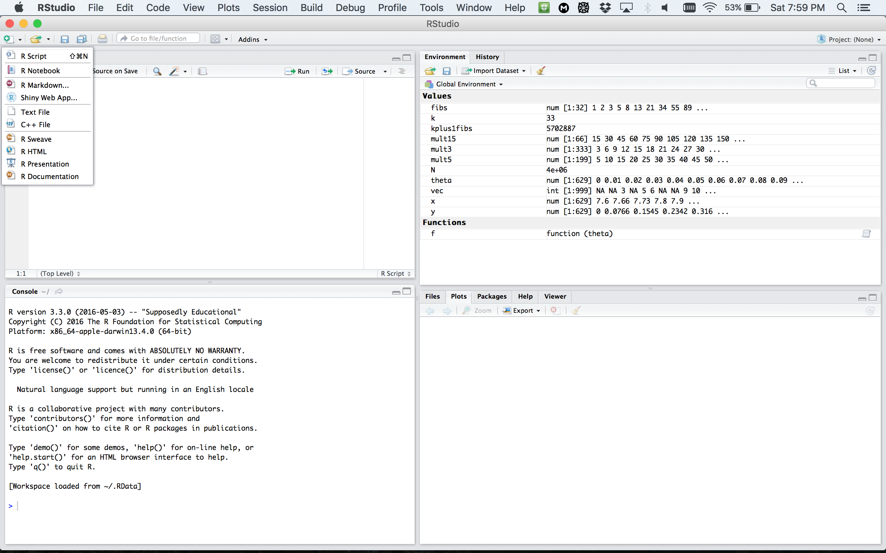

--- 
title: 'Introduction to R'
subtitle: 'Week 1 Session 1'
date: "June 29th, 2020" 
author: 
- Claire Donnat (cdonnat[at]stanford.edu)
- based on the material by Lan Huong Nguyen
output: 
  revealjs::revealjs_presentation:
    self_contained: false
    lib_dir: libs
    theme: simple
    hightlights: haddock
    smart: true
    center: true
    transition: slide
    css: cme195.css
    fig_width: 10
    fig_height: 6
    reveal_options:
      slideNumber: true
---

```{r global_options, echo = FALSE, include = FALSE}
options(width = 999)
knitr::opts_chunk$set(
  warning = FALSE, message = FALSE,
  cache = FALSE, tidy = FALSE, size = "small")
```

## Contents

</br>

- Course Objectives & Organization 

- The R language

- Setting up R environment

- Basics of coding in R

#  Course Objectives & Organization


## Course Logistics

</br>

The bootcamp will run for 8 weeks: 06/29-08/23/2020

- Lectures: Monday, Wednesday, Thursday 10:00 AM - 11:00 AM
- Office hours: Mon 2 - 3 PM, Tue 3 - 4 PM, Wed 3 - 4 PM, and Thu 4 - 5 PM (Others by appointment)
- Class website: https://biox-rbootcamp.github.io/
- Questions/Communication: cdonnat[at]stanford.edu / jameszli[at]stanford.edu

</br>

No Grading but:

- 15 h of work per week
- Flipped classroom format: Labs and videos should be watched and done before the discussion
- Zoom classes are reserved for discussion
- James will also hold office hours several times a week to provide more one-to-one support.

## Assignements: Labs


Assignements ---  i.e the labs that you should work on before each discussion:

- work individually (best for you).
- actively participate in discussion sessions.


## Pre-requisites and expectations

No formal pre-requisites,
knowledge of statistics nor programming experience.

The goal of this course is for you to:

- familiarize yourself with R
- learn how to do interesting and practical things quickly in R
- start using R as a powerful tool for data science

We will NOT learn:

- computer programming
- statistics
- big data

This is a short course, so you will not learn everything about R.


## Topics Covered

- R Basics: data types and structures, variable assignment etc.

- R as a programming language: syntax, flow control, iteration, functions.

- Importing and tidying data.

- Processing and transforming data with `dplyr`.

- Visualizing data with `ggplot2`.

- Exploratory data analysis (EDA)

- Mixture Models

- Clustering

- Testing

- Multivariate Analysis

- Network & Trees


# The R language

## What is R?

- R was created by Rob Gentleman and Ross Ihaka in 1994; it is based on 
the S language developed at Bell Labs by John Chambers (Stanford Statistics).

- It is **an open-source language and environment** for statistical computing 
and graphics.

</img> 

##

> - R offers:
>       + A simple and effective programming language.
>       + A data handling and storage facility.
>       + A suite of libraries for matrix computations.
>       + A large collection of tools for data analysis.
>       + Facilities for generating high-quality graphics and data display.

</br>

> - R is **highly extensible**, but remains 
**a fully planned and coherent system**, rather than an incremental
accumulation of specific and inflexible tools.


## Who uses R?

Traditionally, academics and researchers. However, recently R has expanded also 
to industry and enterprise market. Worldwide usage on log-scale:

</img> 

Source: http://pypl.github.io/PYPL.html

The PYPL Index is created by analyzing how often language tutorials are 
searched on Google (generated using raw data from Google Trends).


## Why should you learn R?

Pros: 

- Open source and cross-platform.
- Created with statistics and data in mind; new ideas and methods in statistics
usually appear in R first.
- Provides a wide range of high-quality packages for data analysis and visualization.
- Arguably, the most commonly used language by data scientists

Cons:

- Performance/Scalability: low speed, poor memory management.
- Some packages are low-quality and provide no support.
- A unconventional syntax and a few unusual features compared to other languages.


## A few alternatives to R:

- **Python:** fastest growing, general-purpose programming, with data science libraries.
- **SAS:** used for statistical analysis; commercial and expensive, slower development.
- **SQL:** designed for managing data held in a relational database management system.
- **MATLAB:** proprietary, mostly for numerical computing, and matrix computations.


## What makes R good?

> - R is an **interpreted language**, i.e. programs do not need to be 
compiled into machine-language instructions.

> - R is **object oriented**, i.e. it can be extended to include
non-standard data structures (**objects**). A generic function can act
differently depending on what objects you passe to it.

> - R supports **matrix arithmetics**.

> - R packages can generate **publication-quality** plots, 
and **interactive graphics**.

> - Many **user-created R packages** contain implementations of **cutting edge statistics methods**.


## What makes R good?

As of September 29, there are 13,083 packages on [CRAN](https://cran.r-project.org/web/packages/index.html),
1,560  on [Bioconductor](https://www.bioconductor.org/), and many others on [github](https://github.com/trending/r?since=weekly))

</img> 

Source: [http://blog.revolutionanalytics.com/](http://blog.revolutionanalytics.com/2017/01/cran-10000.html)


## "Textbook"

We will use *R for Data Science* as a primary reference. Other resources are listed on the website/

</img> 


<small2>Freely available at: http://r4ds.had.co.nz/ </small2>


## Other useful resources for learning R 

- *R in a nutshell* and introductory book by Joseph Adler - *R tutorial*
  (https://www.tutorialspoint.com/r/r_packages.htm) 

- *Advanced R* book by Hadley Wickham for intermediate programmers 
(http://adv-r.had.co.nz/Introduction.html)

- `swirl` R-package for interactive learning for beginners (http://swirlstats.com/) 

- `Data Camp` courses for data science, R, python and more (https://www.datacamp.com/courses) 


# Setting up an R environment

## Installing R

</br>

R is open sources and cross platform (Linux, Mac, Windows).

</br>

To download it, go to the Comprehensive R Archive Network 
[CRAN](https://cran.cnr.berkeley.edu/) website.
Download the latest version for your OS and follow the instructions.

</br>

Each year a new version of R is available, and 2-3 minor releases.
You should update your software regularly.

## Running R code

<div class="left", style="width: 65%;"> 

Interpreter mode:

- open a terminal and launch R by calling "R" (or open an R console).
- type R commands interactively in the command line, pressing `Enter` to execute.
- use `q()` to quit R.

Scripting mode:

- write a text file containing all commands you want to run
- save your script as an R script file (e.g. "myscript.R") 
- execute your code from the terminal by calling "Rscript myscript.R"

</div>

<div class="right", style="width: 35%;"> 
</img> 
</img> 
</div>


## R editors

The most popular **R editors** are:

- [**Rstudio**](https://www.rstudio.com/products/RStudio/), 
an integrated development environment (IDE) for R.
- [**Emacs**](https://www.gnu.org/software/emacs/), a free, powerful, customizable 
editor for many languages.

</br>
In this class, we will use **RStudio**, as it is more user-friendly. 


## Installing RStudio

RStudio is open-source and cross-platform (Linux, Mac, Windows).\
Download and install the latest version for your OS from 
[the official website](https://www.rstudio.com/products/rstudio/download/#download).

</img> 

## RStudio window

</img> 


## RStudio preferences

</img> 


## RStudio layout

</img> 


## RStudio apprearance

</img> 

More on RStudio cuztomization can be found [here](https://support.rstudio.com/hc/en-us/articles/200549016-Customizing-RStudio)


## R document types

</img> 


## R document types

- [R Script](https://cran.r-project.org/doc/contrib/Lemon-kickstart/kr_scrpt.html) 
**a text file** containing R commands stored together.

- [R Markdown](http://rmarkdown.rstudio.com/lesson-1.html)
files can generate high quality reports contatining notes, code and code outputs.
**Python and bash code ** can also be executed.

- [R Notebook](http://rmarkdown.rstudio.com/r_notebooks.html) is 
an R Markdown document with **chunks that can be executed independently and 
interactively**, with output visible immediately beneath the input.

- [R presentation](https://support.rstudio.com/hc/en-us/articles/200486468-Authoring-R-Presentations) 
let's you author **slides** that make use of R code and LaTeX equations 
as **straightforward** as possible.

- [R Sweave](https://support.rstudio.com/hc/en-us/articles/200552056-Using-Sweave-and-knitr) 
enables the embedding of **R code within LaTeX documents**.

- [Other](http://rmarkdown.rstudio.com/formats.html) documents


## R packages 

- R packages are **a collection of R functions, complied code and sample data.**

- They are stored under a directory called **library** in the R environment. 

- Some packages are **installed by default** during R installation and are 
always automatically loaded at the beginning of an R session. 

> - Additional packages by the user from: 
>     + [CRAN](https://cran.r-project.org/web/packages/available_packages_by_name.html) The first and biggest R repository.
>     + [Bioconductor](http://bioconductor.org/): Bioinformatics packages for the analysis of biological data. 
>     + [github](https://github.com/): packages under development


## Installing R packages from different repositories:

- From CRAN: 
 
```{r, eval = FALSE} 
# install.packages("Package Name"), e.g. 
install.packages("glmnet") 
``` 

- From Bioconductor:  
```{r, eval = FALSE} 
# First, load Bioconductor script. You need to have an R version >=3.3.0. 
source("https://bioconductor.org/biocLite.R") 

# Then you can install packages with:  biocLite("Package Name"), e.g. 
biocLite("limma") 
``` 

- From github: 
 
```{r, eval = FALSE} 
# You need to first install a package "devtools" from CRAN 
install.packages("devtools") 

# Load the "devtools" package 
library(devtools) 

# Then you can install a package from some user's reporsitory, e.g. 
install_github("twitter/AnomalyDetection") 

# or using install_git("url"), e.g. 
install_git("https://github.com/twitter/AnomalyDetection") 
``` 


## Where are R packages stored?

```{r} 
# Get library locations containing R packages 
.libPaths()
# Get the info on all the packages installed 
installed.packages()[1:5, 1:3]
# Get all packages currently loaded in the R environment 
search() 
``` 

## Getting you ready for Lab 2

The swirl R package allows to learn R programming and data science very easily. You will use it in Lab 2, so here we are going to install it together. The workflow is the same as for any other R package.  

__Step 1__: Open RStudio and type the following into the console:
```{r, eval=FALSE}
install.packages("swirl")
```
That is just for this time!!! Once swirl is installed on your machine, you can skip directly to step 2.

__Step 2__: Start swirl

This is the only step that you will repeat every time you want to run swirl. First, you will load the package using the library() function. Then you will call the function that starts the magic! Type the following, pressing Enter after each line:

```{r, eval=FALSE}
library("swirl")

swirl()
```

## Getting you ready for Lab 2

The first time you start swirl, you'll be prompted to install a course. For Lab 2, we'll ask you to go through a couple of recommended courses. See website for more information. 


