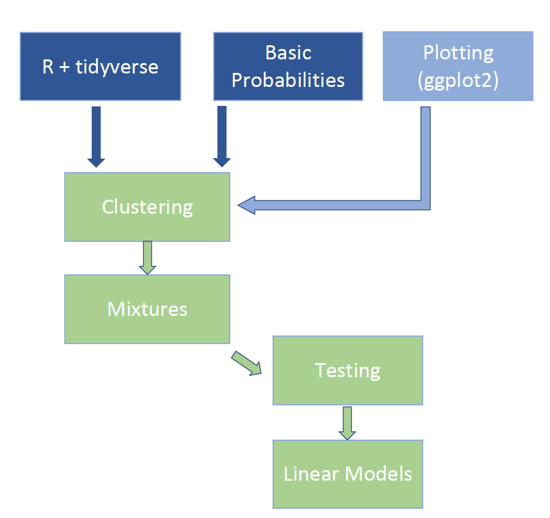
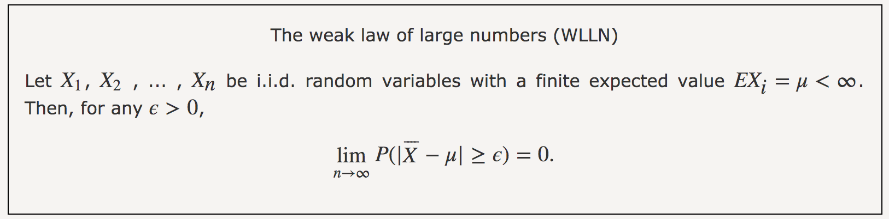
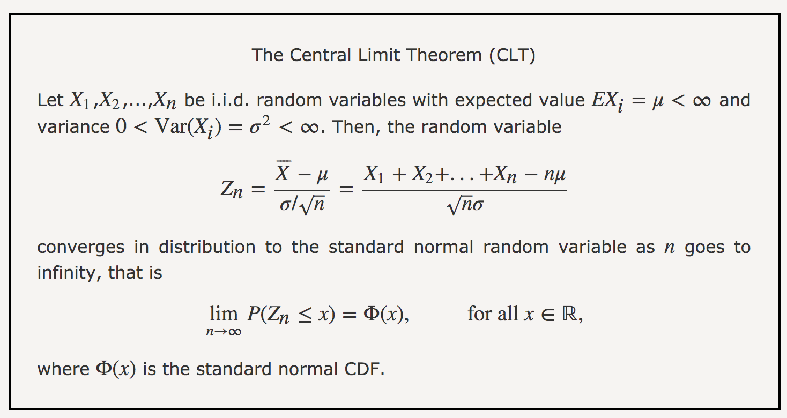

Lecture 5: Probabilities
========================================================
author: Claire Donnat
date: 07/07/2020
autosize: true

Goal
========================================================

The purpose of this lecture is to get you familiar with a key notion in statistics and data analysis:

<center>__Random Variables and their corresponding distributions__</center>


At the end of this discussion (and tomorrow's), you should be able to:

- understand the basics of random variables (provide a definition)

- understand why they are a building block of data analysis
- cite at least 3 probability distributions,
- know what the central limit theorem is

I. What is a random variable?
========================================================

<br />

A random variable, usually written $X$, is a variable whose __possible values are numerical outcomes of a random phenomenon__. 

$\implies$ We know which outcomes can occur but we do not know which outcome will occur.

$\implies$ We cannot predict each outcome, but there will be a regular distribution over many repetitions.
<br />


__A more tangible way to think about the probability of an event is as the proportion of times the event occurs when we repeat the experiment an infinite number of times, independently, and under the same conditions.__

Examples of random variables
========================================================
<br />

- games of chance: poker

- outcome of a toin coss (heads or tail)

- waiting time before the next bus gets here

- number of new cases of COVID everyday

- $\cdots$


Random variables
========================================================
<br />

There are __two types of random variables__:
- discrete (the universe -- space of possible outcomes -- is countable)
- continuous  (tomorrow's lecture)

<br />

__Notations and a few properties__: 

- We use the notation  $Pr(A)$ or $\mathbb{P}[A]$ to denote the probability of event  
A happening.

- The space of possible outcomes is typically denoted $\Omega$.

- Properties:

   + $\mathbb{P}[\Omega] =1,\mathbb{P}[\emptyset] =0$
   + $\mathbb{P}[\Omega]  = \sum_{x \in \Omega } \mathbb{P}[X = x] = 1$ 
   + $\forall x, \mathbb{P}[X = x] \geq 0$


II. Why are probabilities useful?
========================================================
<br />

Probability theory is useful in particular in areas that depend on data affected by chance in some way. 

__$\implies$  They allow to account for noise, uncertainty or stochasticity in the data__:

- to evaluate risk (e.g, finance)

- to build predictive models.

- to quantify our uncertainty (statistics)


II. Why are probabilities useful? Uncertainty quantification (2/3)
========================================================
<br />

Take a clinical trial in bio-statistics for instance:

- group means are random 

- as such, the difference between the two groups is also random

$\implies$ if we want to say that the difference between control and treatment is ``significant'', we need to measure the uncertainty.

II. Why are probabilities useful? Uncertainty quantification (2/3)
========================================================


```r
library(tidyverse)
delta_groups = 6.0
df = data.frame(test11 = rnorm(200, 80 + delta_groups, 3),
             test10 = rnorm(200, 80, 3),
             test21 = rt(200, df =4, ncp = 80 + delta_groups),
             test20 = rt(200, df =4, ncp = 80))

ggplot(df) +
  geom_histogram(aes(test11, fill="treatment 1"), bins=15)+
  geom_histogram(aes(test10, fill="Control"), bins=15)
```


II. Why are probabilities useful? (2/3)
========================================================


```r
ggplot(df) +
  geom_histogram(aes(test21, fill="treatment 2"), bins=15)+
  geom_histogram(aes(test20, fill="Control"), bins=15)
```


II. Why are probabilities useful? Models and answering questions(2/3)
========================================================
<br />

__Example: The birthday problem__

Suppose you are in a classroom with 50 people. If we assume this is a randomly selected group of 50 people, what is the chance that at least two people have the same birthday?

First, note that birthdays can be represented as numbers between 1 and 365, so a sample of 50 birthdays can be obtained like this:

```r
n <- 50
bdays <- sample(1:365, n, replace = TRUE)
```


To check if in this particular set of 50 people we have at least two with the same birthday, we can use the function duplicated, which returns TRUE whenever an element of a vector is a duplicate. Here is an example:

```r
duplicated(c(1,2,3,1,4,3,5))
```

```
[1] FALSE FALSE FALSE  TRUE FALSE  TRUE FALSE
```


II. Why are probabilities useful? Models and answering questions(2/3)
========================================================
<br />

__Example: The birthday problem__
The second time 1 and 3 appear, we get a TRUE. So to check if two birthdays were the same, we simply use the any and duplicated functions like this:


```r
any(duplicated(bdays))
```

```
[1] TRUE
```

In this case, we see that it did happen. At least two people had the same birthday.

II. Why are probabilities useful? Models and answering questions(2/3)
========================================================
<br />

__Example: The birthday problem__

To estimate the probability of a shared birthday in the group, we repeat this experiment by sampling sets of 50 birthdays over and over:


```r
B <- 10000
same_birthday <- function(n){
  bdays <- sample(1:365, n, replace=TRUE)
  any(duplicated(bdays))
}
results <- replicate(B, same_birthday(50))
mean(results)
```

```
[1] 0.9713
```


III. Your favorite discrete probability distributions
========================================================
<br />

What is a discrete probability distribution?

$\implies$ events are countable


III.a The Bernouilli and binomial distributions
========================================================
<br />

- __Bernouilli:__ 
   + models the success or failure of a trial
   + two outcomes (0/1)
   + One parameter: $p= \mathbb{P}[X=1]$
   
III.a The Bernouilli and binomial distributions
========================================================

- __Binomial:__
   + models the number of successes among $n$ different trials $$Z = \sum_{i=1}^n X_i =  \sum_{i=1}^n Bern(p) $$
   + (n+1) possible outcomes: all the integers from 0 to $n$
   + two parameters: $p= \mathbb{P}[X=1]$ and $n$ (number of trials)
   + $\forall k \leq n, \mathbb{P}[X=k] =  {n \choose k} p^k (1-p)^{n-k}$


```r
df<- data.frame(samples= rbinom(10000, 100, 0.3))
ggplot(df)+ geom_histogram(aes(samples), bins=50)
```


III.b The multinomial distribution
========================================================
- Given $N$ objects, how do you distribute them into $K$ categories?
- $K$ parameters:
   + the number of objects $N$
   + the probability vector associated to the $K$ categories.


```r
p = c(1,2,3,0.5,2)
p = p/sum(p)
df<- data.frame(t(rmultinom(10000, 100, p)))
ggplot(df)+
  geom_density(aes(X1, fill = "X1"),adjust=1.3)+
  geom_density(aes(X2, fill = "X2"), alpha=0.5,adjust=1.3)+
  geom_density(aes(X3, fill = "X3"), alpha=0.5,adjust=1.3)
```


III.c The Poisson distribution
========================================================

- For modeling count data, with one parameter: the rate $\lambda$ (mean of the counts)
- $\forall k, \mathbb{P}[X=k] =  \frac{e^{-\lambda} \lambda^k}{k!}$


```r
df= data.frame(sample3 = rpois(1000, 3), sample10 = rpois(1000, 10))
ggplot(df) +
  geom_density(aes(sample3, fill = "sample3"),adjust=1.3)+
  geom_density(aes(sample10, fill = "sample10"), alpha=0.5,adjust=1.3)
```


IV. Your favorite continuous probability distributions
========================================================
<br />

- Outcomes are no longer ``atoms''. 

- thus, we measure probability for intervals, not single values.

- Continuous probability distribution: p(x)

- $\mathbb{P}[X \in(a,b)] = \int_a^b p(x)dx$

IV.a The Gaussian distribution
========================================================

- Two parameters: the mean $\mu$ and variance $\sigma^2$
- $p(x) = \frac{1}{\sqrt{2\pi \sigma^2}} e^{-\frac{(x-\mu)^2}{2\sigma^2}}$


```r
df= data.frame(sample1 = rnorm(10000, 1, 1))
ggplot(df) +
  geom_density(aes(sample1, fill = "sample1"),adjust=1.3)
```


IV. b. In class exercise:
========================================================

COVID-modeling: simplification of the Susceptible-Infected-Recovered model:

- each day, $X_t$ patients are infected.

- Each of them contaminate $R_0$ new patients according to a Poisson distribution, and are put in quarantine in the evening. The new cases will exhibit symptoms the next day.

$$ X_{t+1} = \sum_{i=1}^{X_t} Poisson(R_0) = Poisson(X_tR_0)$$

(a) Choosing $X_1=5$ and $R_0=1.03$, model 10,000 trajectories.

(b) Compute for each of these epidemic trajectories the cumulative number of cases.

(c) What is the probability that the epidemic infects over 1,000 people in a month?

(d) What is the probability that the epidemic infects over 10,000 people over 100 dats?


IV. b. In class exercise (solutions)
========================================================

```r
r0 = 1.03
B =1000
cases = matrix(0, B, 100)
cases[,1] = 5
for (t in 2:100){
  #cases[,t] = sapply(cases[,t-1], function(x){rpois(1, x * r0)})
  for (b in 1:B){
    cases[b,t] = rpois(1, cases[b,t-1] * r0)
  }
}

cumcases = t(as.matrix(apply(cases,1, cumsum)))
plot(apply(cumcases,2, mean))
```


```r
mean(cumcases[,30]>1000)
```

```
[1] 0.041
```

The road so far
=======================================================





V. The central limit theorem and law of large numbers
========================================================
<br />
These are two building bricks of statistics and data analysis:

- Law of large numbers tells you that the more data you have, the closer to the actual underlying true value your estimates can be. 

- Central limit theorem is an approximation theorem.


V.a The law of large numbers
========================================================
<br />

In a nutshell : 

__If you repeat an experiment independently a large number of times and average the result, what you obtain should be close to the expected value: $$\bar{X}=\frac{X_1 + \cdots + X_n}{n} \to \mathbb{E}[X]$$__




V.b The central limit theorem
========================================================


In a nutshell : 

__Under certain conditions, the sum of a large number of random variables is approximately normal.__





VI. Population average, standard deviation


V.b The central limit theorem
========================================================


- It does not matter what the distribution of the $X_i$'s is. 

- The $X_i$'s can be discrete, continuous, or mixed random variables. 

$\implies$ Extremely powerful to derive the behavior of your statistics and quantify uncertainty.
